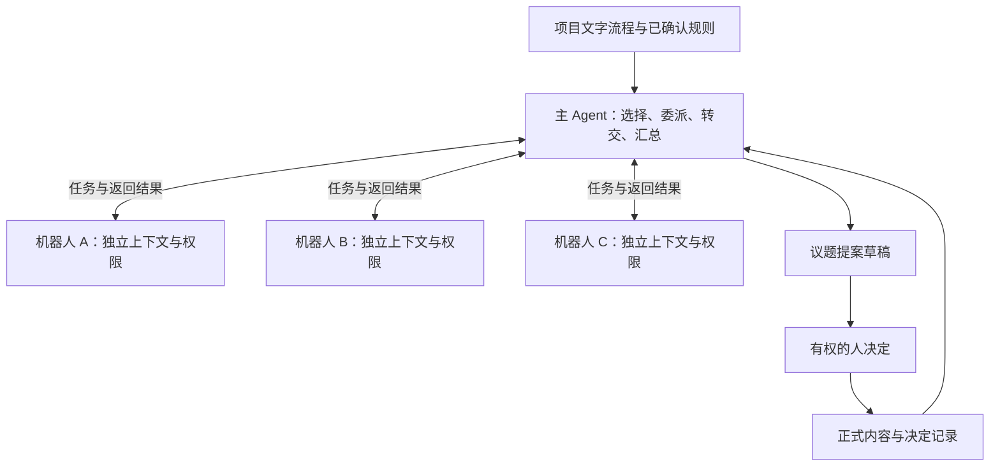

# Agent 协同架构讨论

技术选型更新：Q057、Q058 已确定 Go + Gin、参考 pi 的四工具及上下文机制、单独实现业务工具，OpenSandbox 为明确执行方向。当前实现方案见 [Agent 执行与上下文](./详细设计/06-Agent执行与上下文.md)。下文包含当时的候选调研，涉及“是否直接复用 TS 包 / 是否选择沙箱”的未定表述已被最新讨论更新，不能再次作为并列实施方案。

后续 Q070～Q075 已将执行上下文改为独立 SQLite，项目共享业务资料统一只读、项目内取消逐文件授权；私人配置 / 执行上下文与跨项目边界保留。明确输出后才发布新的共享草稿。下文早期逐材料共享讨论以这次确认范围为准，详见 [工作目录与动态上下文](./详细设计/11-工作目录与动态上下文.md)。

日期：2026-09-25。状态：已记录至 Q055 及补充。明确确认的可校验业务前置由代码检查，普通流程路线仍供 AI 参考；交接、局部拒收、补交、流程更新和重开的业务原则已确定。具体工具契约、条件编码与运行实现仍待开发验证。

## 1. 已有方向与本轮边界

用户提出：项目创建时用文字制定流程、规定环节参与机器人；主 Agent 通过 `list_agent` 了解机器人及结合个人设置的提示词，通过 `call_agent` 调用；子 Agent 在权限内自行探索，问题与结果返回主 Agent；主 Agent 决定向谁传递什么；子 Agent 支持并行。

Q037 进一步提出：岗位名称与职责由项目用户自由定义；同一职位模板可由多人分别承担，各有结合模板提示词和个人提示词的 AI 工作身份，界面以关联人及其职位呈现。用户与 AI 沟通建立多张 Mermaid 图，让计划和任务按图流转，职位可选择挂载流程，代码参与硬约束校验。下文设计、产品、研发等称谓都是示例，不是平台内置岗位。

Q038～Q041 进一步确认：新增成员与替换关联人分别处理，替换保留原任职身份的工作和历史；职位绑定到具体流程的具体节点；图和规则经人工确认同版生效；同一计划或任务多人共享一份运行记录。用户随后限定流程用途：类似知识库和系统提示词，每次模型调用都作为实际情况判断与挑选讨论对象的参考。图不被默认解释为无人确认的固定执行引擎。

计划和任务创建时已分配关联机器人，计划负责人负责整体验收和状态更新。AI 提出推进建议，各来源分别确认，接收人明确接受完成交接或选择性拒收；未最终验收交付退回待完善，相关后续暂缓。Q053 允许当前有权验收的人确认重开已验收任务，保留历史，修正与复核另记一轮，新范围另建任务。

当前职责交付、交接接收与最终验收分别记录。Q050 明确未变化且未受影响来源保留接收，Q051 明确接收超时只提醒协调。Q055 又明确用户确认为硬性要求的可校验前置/资料条件由代码检查；模型不能自行将推荐路线变成强制顺序，也不能绕过已批准的硬要求。

沿用已确认原则：AI 内容先为草稿，按议题提案由有权人决定后正式生效；人可绑定多个机器人；原始材料先登记，确认时可补充用途；本地获取由用户手动调用 Skill，平台不主动触发本地 AI。

本轮确认：文字流程经澄清与人工确认后形成参与和授权约束；主 Agent 保持一个身份、按议题分别保存会话；主 Agent 不自动继承子 Agent 全部资料权限，转交继续检查接收范围；子 Agent 同议题续接、跨议题按需加载业务知识、单次探索上下文分别管理。

V2-Q013、Q014 进一步确认：未确认经验可带“AI 归纳、待验证”标识和依据作为线索，不能成为正式规则或承诺；知识默认在当前项目及已授权共享范围内使用，跨项目通用经验需要确认和明确授权。具体后端仍未选择。

V2-Q015～Q017 进一步确认：线上协同可按流程事件自动触发并保留手动入口，连续相关材料可合并处理，等待时不重复讨论；AI 提出的材料关联和新议题建议必须经人确认才正式生效；决定绑定明确审阅版本，新信息形成修订草稿，提交决定前检查依据和依赖变化。

V2-Q018～Q026 已明确：CLI/Skill 在本人明确同意具体事项后可代提交直接完成审批，Web 有讨论内审批框和“待我审批”卡片；主管或负责人可代批明确选中的未回应项。不同问题和步骤分别审批；同一个问题需所有指定审批位满足同意，首人通过后计时，未回应者超时默认同意；任何一人带原因退回则本次提议取消。修订提议重新审批，不继承旧同意和计时；明确停止方向时不自动重提。时长采用项目默认、环节可调，24 个自然小时仍为推荐默认值，后续同意不重置倒计时。平台 AI 的调度判断不能冒充人的审批。

V2-Q027～Q029 已明确：AI 从文字流程提取完成条件，成果回传后提出验收建议，按既有审批规则接受后正式完成；执行过程绑定机器人，换人不创建新运行主体、迁移记录或重置审批。机器人页聚合议题与待决事项，进入对应 Chat 查看讨论、成果和审批卡片；Chat 下方有输入框，人能提问、提供信息、证据与文件辅助机器人。新绑定人访问原有 Chat 与审批记录。

人工输入是平台主 Agent 的议题输入之一，实际来源和身份应保留；主 Agent 再按项目流程选择需要调用的机器人。Q030 已确认普通聊天不直接构成审批，Web 的正式决定由对应审批卡片操作产生；CLI 本人明确指定事项并同意后的直接代提交能力继续有效。输入框不改变中心调度、资料权限或草稿转正式规则。

本文把调用项目线上机器人与调用成员电脑上的本地 AI 明确区分。`call_agent` 面向线上项目机器人，不将其解释为远程启动成员的本地工具。

## 2. 官方实现核对

以下依据本轮访问的官方文档与主分支源码。说明机制，不声称完成版本实测，也不据此替 Judex 选定依赖。

| 参考 | 控制与信息流 | 与 Judex 的关系 |
| --- | --- | --- |
| [LangChain Subagents](https://docs.langchain.com/oss/python/langchain/multi-agent/subagents) | 主 Agent 选择子 Agent 和输入，子调用隔离上下文，结果返回主 Agent；文档展示 `list_agents` 加统一 `task` 工具，并允许并行 | 与用户的发现加调用、居中调度方向高度接近 |
| [LangChain Handoffs](https://docs.langchain.com/oss/python/langchain/multi-agent/handoffs) | 通过状态切换当前处理对话的 Agent 或步骤 | 适合转交对话控制权，与固定由主 Agent 汇总的方式不同 |
| [Claude Code Subagents](https://code.claude.com/docs/en/sub-agents) | 子 Agent 有自己的提示词、工具配置与上下文，向调用方返回结果 | 可参考专门职责与上下文隔离；不假定所有框架都禁止子 Agent 间通信 |
| [Claude Code Agent Teams](https://code.claude.com/docs/en/agent-teams) | 独立会话之间可直接通信，并利用共享任务协调；当前文档标为实验功能 | 是另一类团队互联机制，用户提出的模式更强调主 Agent 掌握转交过程 |
| [Google ADK 工作流](https://adk.dev/agents/custom-agents/) | 提供顺序、并行与自定义编排机制，也可以组合工具化 Agent | 用来比较显式流程与动态调度，不能将同一 Session 误认为所有 Agent 共用同一模型上下文 |
| [Anthropic Research](https://www.anthropic.com/engineering/multi-agent-research-system) | 主 Agent 组织并行研究、综合结果，成果可外部保存并返回引用 | 可参考协调任务与资料交接，具体业务授权仍由 Judex 定义 |

判断：中心调度、子 Agent 作为工具和动态发现都有已有先例。Judex 的产品差异可以来自稳定机器人身份、人的绑定与替换、项目流程约束、成果回流和人工正式化机制的组合，不能把调度拓扑本身称为此前不存在的新机制。

## 3. Pi 能提供什么

当前官方仓库入口为 `earendil-works/pi`。默认编码工具为 `read`、`bash`、`edit`、`write`；还提供可选工具，四工具是默认组合而非能力总数。[工具源码](https://github.com/earendil-works/pi/blob/main/packages/coding-agent/src/core/tools/index.ts)

Pi 的通用 Agent 核心负责模型循环、工具执行和事件等能力，编码 Agent 层整合工具与会话体验。当前核心默认支持并行执行一批工具，工具也可要求串行；是否发出多个调用仍取决于模型和调用结构。[Agent Core](https://github.com/earendil-works/pi/blob/main/packages/agent/README.md)

其压缩机制能够生成摘要并保留可追溯的原始会话记录，但压缩摘要不等同于业务决定或岗位长期知识。[Compaction](https://github.com/earendil-works/pi/blob/main/packages/coding-agent/docs/compaction.md)

官方子 Agent 扩展示例支持单次、并行与串行链调用，通过独立 Pi 进程提供独立上下文。该示例使用 `--no-session`，不是完整的持久项目机器人实现。[扩展示例](https://github.com/earendil-works/pi/blob/main/packages/coding-agent/examples/extensions/subagent/index.ts)

Judex 的推论：可以复用或参考其运行机制，但项目机器人目录、流程权限、角色记忆、草稿与审批、运行恢复仍是产品自己的职责。参考 Pi 不等于现在决定嵌入其包、启动其 CLI 或用 Go 重写；语言和集成方式后续决定。

## 4. 统一 harness 与多个运行实例

建议采用同一套 harness 实现来运行主、子 Agent，但每个活动运行拥有独立的消息上下文、身份、权限与输出空间。

统一 harness 表示共享运行机制，不表示把所有机器人的消息放入同一个可变数组，也不限定所有 Agent 必须共用一个进程。并行运行必须分别保存消息、调用结果与临时产物，避免角色和数据相互覆盖。

机器人是稳定业务身份，运行实例是完成一次工作的活动。一个机器人可以参与多次协作；其历史与当前提示词如何进入运行上下文，需要明确加载规则。

按 Q028，运行实例、议题会话、资料和业务进度以机器人身份为归属，不以某次人的绑定关系作为存续条件。换人更新当前可操作身份，不销毁或重建这些运行与记录；审批事件另行保存实际操作者，待决项仍关联机器人及流程职责。正在运行的平台协同和已有计时不因更换绑定人而重新开始。

主 Agent 的任务是组织 AI 协同与形成提案。它作出的“接下来调用谁”是调度选择；“正式改变交付安排”仍是人的业务决定。不能把这两种决定合并为同一权限。

## 5. 项目文字流程的候选实现

用户可以继续用自然语言配置，例如：

> 设计评审由设计机器人提出候选方案；产品机器人检查目标一致性，研发机器人评估实现约束，两者可以并行。主 Agent 汇总分歧。方向由产品负责人决定，设计定稿由有权的设计负责人决定。未获批准的建议保留为草稿。

V2-Q009 已确认将文字流程拆成两个层面：

- **工作方法**：关注什么、采用什么表达方式、何时建议补充讨论，由 AI 理解并灵活执行。
- **执行约束**：环节参与者、资料范围、必须征求的意见、谁能确认，由系统记录并核验。

文字对话继续作为用户编辑入口。Q040 已确认由 AI 生成明确规则，进一步生成 Mermaid 图与环节说明，人确认后同版生效。Q039 已明确职位挂载具体流程节点。运行时模型利用流程和节点职位关系理解当前步骤、选择参与分析的身份并提出建议；含糊或冲突的授权仍须澄清，不能从流程图文字自动扩权。

例如流程禁止某机器人参与本环节，`call_agent` 就应拒绝调用，而不是只靠主 Agent 记住一句提示词。AI 认为需要例外时提出流程修改草稿，由人决定。

上述例子针对已批准的禁止性授权。Q055 已明确推荐路径与硬性要求的区别：只有经用户明确确认为硬要求、可被明确校验的条件才作业务门槛，普通连线与候选职位继续供模型参考。放宽硬要求由有权人调整，不以模型判断自动改规则；资料和审批权限仍由授权机制核验。

运行应能标明使用哪个流程版本。具体如何处理运行中修改流程、撤回权限与已经生成的草稿，后续细化；权限撤回应由运行层及时落实，不能因旧上下文仍在就继续越权。

Q049 明确新版生效后直接更新后续模型提示词，不要求逐事项批准切版。Q052 明确无实质影响的旧卡继续处理，有实质影响则更新建议，由发送人确认改变后的交接内容，再交接收人处理；原记录保留。版本标识说明实际依据，不成为默认锁住旧流程的机制。

这套“文字入口、经确认的参与与授权边界”已获 V2-Q009 接受；Q040 确定规则与图的共同来源，最新补充明确 AI 参考与人的正式操作分工。具体规则结构与校验方式仍未实现，不将模型推荐路线直接等同于不可变的状态机迁移。

### Mermaid 表达与代码校验的事实边界

已核对官方文档：Mermaid 的 parse 校验图定义语法，render 负责渲染；解析成功本身不校验 Judex 的岗位权限、审批条件或成果版本。[Mermaid API](https://mermaid.js.org/config/setup/mermaid/interfaces/Mermaid.html)

状态图可以表达状态、转移、分叉、汇合等结构，可用于呈现工作流。业务含义仍需由 Judex 定义，例如谁可提交、流转需要什么报告和批准、退回后如何处理。这里不声称 Mermaid 不能作为自定义执行语言的输入。[状态图语法](https://mermaid.js.org/syntax/stateDiagram.html)

Q040 已确认：AI 生成明确规则，以同一份定义生成 Mermaid 图和环节说明，经人确认后同版生效。最新补充限定其运行方式为模型参考，不意味着选定了固定流程引擎。具体哪些条件由代码强制检查仍需进一步定义。受限 Mermaid 加业务注释曾作为另一条候选入口讨论，但未被选定；普通注释本身不会自动成为业务约束。[流程图与注释](https://mermaid.js.org/syntax/flowchart.html#comments)

Q039 明确直接挂载到具体流程的具体节点。模型据此选择当前步骤的讨论参与者；该选择不自动修改已创建工作的正式分配。Q041 明确不同类型计划/任务选择适用流程，并各自保存一份业务运行记录，同岗多人不复制工作。具体同岗成员的调用选择与候选筛选仍应结合已有分配和权限，不能默认全员收到全部上下文。

既有 Q009 的灵活工作方法及授权边界、Q017 的已审版本要求继续有效。用户操作是正式状态变更来源，模型负责分析和建议。代码校验身份、授权、决定版本及经确认的硬要求，不把模型调用结束或材料已上传当作成果质量通过。条件字段与校验实现仍需工程设计，不再据此重新询问 Q055 已确认的业务原则。

### 每次调用的流程参考与正式推进

按用户要求，每次项目模型调用均提供项目流程参考与节点职位关系，使模型知道可以向哪些工作身份发起讨论。该要求不等于全项目私人资料和个人提示词都向主 Agent 开放；已有 Q011 权限边界继续有效。文本格式、稳定前缀或缓存等实现细节后续验证，不擅自把用户要求替换为仅在首轮提供流程。

推进候选由对应发送人确认，接收人明确接受才完成交接，多来源可分别接收或拒收。Q050 已确认未变化且未受影响的来源保留接收结果，补交与受影响内容才复核；各次交付、确认和反馈需可追溯。Q051 已明确到配置时限后提醒接收人和计划负责人，保持待接收，不套用多人审批超时同意。

这里分别记录讨论调用、本人交付上报、最终验收、推进建议、发送确认和接收反馈，不用一个模型结论代替这些业务事件。计划汇总可作为 AI 分析呈现；计划负责人本人负责整体验收和状态更新。接收拒绝只明确了人工反馈与继续完善的路径，不能推定会自动撤销整个任务树中的其他结果。

后续分析直接读取新版流程提示词，人的决定绑定已审内容。Q052 已确定受实质影响的旧卡须重确认改变后的交接内容；不静默改旧决定，也不恢复逐计划迁移审批。普通接收不隐式触发最终验收；任务重开事实可引发提醒，计划正式状态仍由负责人决定。

## 6. 两个工具的候选职责

### list_agent

列出项目范围的机器人及可调用条件，帮助主 Agent 找到合适参与者。用户要求提示词结合个人设置；建议同时提供简述和按需详情，而不是每次把全部全文塞入调度上下文。

职位模板、稳定任职身份与具体调用目标分别表达；模板可绑定流程节点。list_agent 可围绕当前参考流程、节点与授权列出候选分析参与者，具体发现/派发契约仍待设计。不得只凭职位名称默认调用同岗所有成员或共享其私人提示词，也不能将讨论候选列表当成工作重新分配事件。

建议返回：机器人标识、负责范围、适合处理的问题、当前环节参与条件、提示词版本，以及在权限允许时查看生效提示词的入口。完整生效提示词在实际调用时由运行层装配，主 Agent 的任务说明不应覆盖机器人身份或扩大工具权限。

建议生效提示词分层：平台约束、已确认项目流程、机器人职责、被允许使用的个人偏好、本次任务。个人表达偏好可以影响沟通方式，不能授予新的权限。根据 V2-Q011，主 Agent 不自动获得全部个人设置的读取权；查看完整提示词也需授权，运行层为子 Agent 装配提示词不意味着向主 Agent 公开其中全部内容。具体个人设置的可见性规则仍待细化。

2026-09-25 的工作室 Demo 已增加对应配置与组合预览：职责保存在项目与机器人下，个人偏好保存在项目与本人下；可查看的组合进入本地工作简报。为体现私人配置边界，Demo 仅允许预览和导出本人拥有且应用于自己机器人的偏好，项目负责人不例外。此为可体验的界面方案，尚未连接 list_agent、call_agent 或真实运行时；稳定身份、权限执行、调用版本记录和私人配置授权范围仍需生产实现。详见 [工作室交互闭环](./工作室交互闭环.md)。

### call_agent

调用项目中已经配置并获准参与的机器人。建议每项委派包含：要回答的问题、所属议题和环节、必要材料引用、预期输出及可选的会话续接信息。

子 Agent 收到任务后，可以在自身权限内继续检索与分析，不限于主 Agent 附带的几段材料。如果需要其他机器人的信息，向主 Agent 返回缺口和问题，由主 Agent 决定后续调用与转交。

建议模型可在同轮发出多个独立调用，或者工具支持一批明确可并行的请求；底层统一控制并发与预算。选择哪一种工具参数形式、同步等待还是运行中分批返回，尚未确定。

返回建议包含：结论或阶段结果、依据引用、未解决问题、需要的输入、产物位置和实际运行状态。业务内容继续是草稿；“工具执行完成”不代表任务被人验收。

两个工具是模型看到的入口，后台仍需负责排队、取消、超时、失败回收和恢复。并行 A、B、C 中 B 失败时，应保留 A、C 已完成结果，报告 B 的缺口；若流程要求 B 必须提供分析，不能把运行失败改写为其已完成分析。这与 Q020 人工审批超时规则是两类事件，不能混为一谈。

四个基础工具可以通过受限的工作目录与平台 CLI 接上资料读取和草稿登记，不必为了每项业务增加模型工具；底层 API 仍按机器人身份验证权限。运行日志由 harness 保存，不能仅靠主 Agent 自己记得写文件。具体入口形式待实现设计，四工具的数量并不代替业务服务。

按用户提出的中心信息流，建议只有主 Agent 暴露这两个调度工具，子 Agent 默认不直接调用其他机器人。子 Agent 需要其他参与者时向主 Agent 请求；这不是限制主 Agent 调用次数，而是保持清楚的协调归属。

## 7. 信息转交与真实权限

V2-Q011 已确认：主 Agent 读取获准的项目资料与可共享回复，不自动获得全部资料权限，转交时继续检查接收范围。建议资料服务与运行层落实此检查；调用某机器人不授予主 Agent 对该机器人的全部私人资料的访问权。

子 Agent 返回可共享的结论、依据引用和待解问题；主 Agent可以传递必要的原文片段或资料引用，不必每次重新改写。保留来源、版本和不同意见，降低多次转述后的信息丢失。

资料可见性的原则已由 V2-Q011 确认，具体权限模型继续设计。访问限制必须涵盖实际资料读取和命令执行：仅在提示词里写“只读”不足以限制一个有广泛 `bash` 权限的运行实例。

即使保留四工具，`write` / `edit` 也可以只写分析工作区和草稿，正式业务记录通过人工决策后的业务服务更新。不能开放通过文件或数据库写入直接绕过转正式规则的路径。具体隔离实现和沙箱选型尚未确定，不继承 V1 的技术决定。

## 8. 会话、记忆与压缩

建议区分三种保存内容：

| 内容 | 用途 | 约束 |
| --- | --- | --- |
| 正式内容、决定和原始材料 | 项目事实与依据 | 独立保存，不依赖模型压缩摘要 |
| 机器人业务知识与经验 | 跨次工作复用 | 标明来源、适用范围与是否被确认，不把 AI 猜测自动升级为团队规则 |
| 本次议题运行上下文 | 当前调度与分析 | 可压缩、可重建，按权限加载必要历史 |

主 Agent 的压缩应保留当前议题、流程版本、必须参与者、已返回结果引用、待回收调用、分歧和等待的人类决定。压缩不能删掉记录中的异议后把“没有看到异议”解释为一致通过。

V2-Q010 已确认：主 Agent 保持一个协调者身份，按议题隔离调度会话，共享获准的项目正式内容，关联议题通过引用衔接。不同议题对同一正式内容提出修改时，建议在决定前检查依据版本与冲突。

V2-Q012 已确认：子 Agent 同一议题续接会话，跨议题按需加载业务知识，单次探索上下文分别管理。建议同一会话的并发续接排队或明确分支，避免同时改写消息记录。跨议题记忆后端尚未选定，参见 [跨议题记忆选型](./跨议题记忆选型.md)。

## 9. 一次设计评审的调度示例

本例演示候选机制，不代表额外业务规则已经确认。

1. 成员在本地完成候选设计，上传材料。系统登记来源与时间，可先附用途，也可在确认时补充。
2. 主 Agent 读取本议题、项目流程和材料，列出本环节可调用的机器人。
3. 将相同候选版本分别交给产品机器人、设计机器人、研发机器人，提出不同的分析问题，允许独立并行。
4. 各机器人按权限探索并返回意见、依据或缺失输入。主 Agent 保留每一份原始返回。
5. 主 Agent 发现分歧后，只把与问题相关且允许分享的信息交给需要复核的机器人，继续一轮定向讨论。
6. 达到充分信息、缺乏新依据、预算上限或需要人取舍时，形成有明确分歧和依据的提案；不为追求全员一致而无限循环。
7. 不同问题或步骤分别审批，有权人可以接受某些独立提议；同一个问题的审批中任意一人退回必须说明原因，该提议取消。确认时可以说明某份材料只是参考，平台只按通过的独立事项更新正式内容。
8. 成员下次手动调用 Skill 时获取新的决定；线上机器人调度不会唤起成员的本地 AI。

界面建议显示议题下的委派记录、各机器人返回、主 Agent 如何形成提案以及人最终决定的范围。默认不展示所有探索日志，但能够按权限展开依据，识别主 Agent 是否遗漏重要异议。

## 10. 第三轮答复记录

**V2-Q009：文字流程怎样成为执行约束？** 是否接受用户写文字，AI 整理出参与者、资料范围与决策人等规则供人确认，再由调用和资料访问层执行？

用户答复：“接受。工作方法保持灵活，参与和授权边界有明确约束；含糊处先澄清。” 已确认。

**V2-Q010：主 Agent 的调度会话怎样组织？** 整个项目长期共用一个对话，还是保持一个协调者身份、按议题分别保存调度上下文？

用户答复：“一个身份、多个议题会话。共享项目正式内容，关联议题通过引用衔接，避免不同工作互相干扰。” 已确认。

**V2-Q011：主 Agent 是否自动拥有所有子 Agent 的资料权限？** 它需要知道每次返回结果，但是否也可以读取所有私有资料、个人设置和探索记录？

用户答复：“不自动获得全部权限。主 Agent读取获准的项目资料和可共享回复；转交给其他机器人时仍检查接收范围。” 已确认。

**V2-Q012：子 Agent 是否保留跨调用记忆？** 同一机器人再次被调用时，是每次全新开始，还是可以记住同一议题的前次工作并复用岗位经验？

用户答复：“允许。同一议题续接会话，跨议题按需加载业务知识，单次探索上下文分别管理。” 已确认。用户进一步要求研究跨议题记忆的开源项目，已知 Mem0，希望获得其他推荐。
