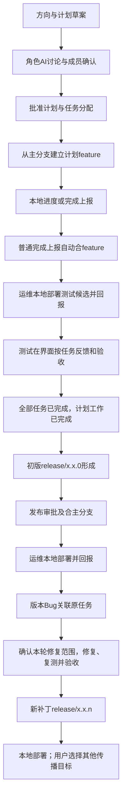

# Judex 详细设计

> 历史归档：本稿的平台Git写入、代码处理和发布执行方案已被2026-09-24的Q071架构重置替代。当前规则见[现行详细设计](../详细设计.md)，本稿不作为开发依据。下方正文保留归档当时状态。

文档状态：Q060—Q065已回答，确认结果见第21节；下一轮Q066—Q075及依赖边界见第22节，尚未确认的建议不作为业务定案。  
更新时间：2026-09-24。  
讨论记录：[QA.md](../QA.md)。

## 1. 文档依据与约定

本稿依据原始设想、历轮答复、2026-09-24 整体评审后的六点反馈和 AGENTS.md 编写。业务规则、用户待讨论提议与工程实现建议分开表达，历史问题和被替代方案保留在 QA。已提供交互 Demo；本轮授权同步文档和继续讨论，生产后端与真实外部集成尚未实施。

状态含义：

- **用户已明确**：用户原始描述或后续答复已经表达的目标或要求。
- **建议**：用于讨论的设计提案，不能直接作为已批准的开发任务。
- **待讨论**：存在会改变产品或架构的分叉，问题编号见 QA。

用户已要求将讨论落入文档，并通过可操作 Demo 核对流程；生产实现范围和技术方案仍按后续确认推进。本文中的对象名和协议字段属于设计表达，不表示真实 API 已存在。

## 2. 产品定位与整体确认摘要

Judex 是面向团队的项目协同、Git 管理和平台角色 AI 工作系统。成员继续在本地使用自己的 AI 软件，通过 Skill/CLI 获取上下文和提交成果；平台运行角色 AI，组织讨论、任务、代码交付、人工验收、版本发布与维护。

平台不接管成员个人 AI 会话。工作成果包括代码、文字、图片、网页和文档，正式状态由有权限的业务动作、人工验收和可追溯的执行结果推进。

### 2.1 当前核心闭环

工作状态、维护批次与部署状态分开；修复导致工作回退，不抹掉历史部署。Q065允许原计划仍有其他未结工作时，本轮已确认范围验收后先形成补丁。后续补丁传播主分支需要被明确选中，这不取消普通首发审批后合主分支的既有步骤。

### 2.2 审阅时需要确认的要点

| 主题 | 当前规则 |
| --- | --- |
| 项目与角色 | 同岗可建立多个独立机器人，人员绑定对应机器人；支持兼岗、替换任职者和工作接续 |
| 平台与本地 | 平台角色AI执行分析与授权代码工作，本地AI继续开发；统一API和CLI接入 |
| 讨论与审批 | AI选人和判断层级，配置节点强制结论层；内容名单冻结，首票计时，当前轮有反对则失效，已结束只读 |
| 任务与计划 | 开发完成需人工验收为已完成；实际开发修复未完为开发中，就绪待验收为测试中，全部任务验收为计划已完成 |
| Bug | 绑定版本和任务，任务进入修复；不自动建新计划池，不由代码合入自动认定验收 |
| 发布版本 | 初版有序且累积前序已发布功能；维护按人确认的批次形成新补丁，不要求原计划所有历史问题同时结束 |
| 传播 | 用户明确选择目标，列明基线与新补丁；源任务完成与传播进行中/部分失败独立 |
| 部署与测试范围 | 运维使用本地AI或手动部署测试/生产环境，主动通过界面或CLI回报；测试界面勾选任务并提交图文，不负责内部代码影响分析 |

## 3. 现行需求清单

| 编号 | 当前产品要求 | 约束或实现说明 |
| --- | --- | --- |
| C01 | 用户可创建多个项目，一个项目关联多个 Git 仓库/服务 | 项目负责人邀请成员，仓库与服务关系在项目配置中描述 |
| C02 | 项目角色职责优先，个人提示词补充方法与偏好；本人和负责人可见完整个人提示词 | 当前运行固定版本，下轮采用新版；跨项目复制后独立维护 |
| C03 | 默认提供主管、项目经理、开发、测试、运维、运营等角色模板；支持兼岗和同岗多人 | 模板可选和可配置，角色提示词不代替服务端权限 |
| C04 | 本地 AI 通过 Skill + CLI 接入，保留统一 API | 平台不假设能远程唤醒或控制成员个人 AI 软件 |
| C05 | 平台运行角色 AI；项目配置模型和运行上限；当前不提供被管理项目自动化测试 | AI 触发、上下文和模型运行管理 |
| C06 | 首票起计时、项目设时长、一票有效反对失效；已结束审批关闭操作并拒绝旧请求 | 终结与后续动作的一致性实现 |
| C07 | 计划、架构、仓库初始化清单经相应确认后，由平台执行创建和初始化 | 新仓库须有可作为计划基线的主分支，执行和部分失败可追溯 |
| C08 | 初版以当前已批准交付范围验收为条件；维护按人确认的本轮范围独立验收，递增形成新补丁 | 同系列最新已验收且完整形成版本为补丁基线；本批完成不等于原计划全部工作完成 |
| C09 | Bug必须关联版本、计划与任务；创建后任务修复中；测试或经理依据修复验收确认任务完成 | 开发修复就绪与人工复测验收分别留证，不用AI估算替代 |
| C10 | 运维用本地AI或手动部署测试和生产环境，再通过界面或CLI主动回报环境、版本、结果 | 测试候选与正式版本均可追溯；不改变既有Git执行分工 |
| C11 | 运营使用本地工具分析数据，提交网页、文字和文档报告 | 数据接入与定时执行由哪一侧负责 |
| C12 | 人类确认正式报告和验收；平台AI与本地AI完成授权工作 | 中间层ANY、结论层ALL、首票计时、项目超时同意、有反对则当前轮失效 |
| C13 | 项目代码、任务、文字、图片、网页和文档结构化存储并供AI分析 | 保留原始内容、解析/派生成果、引用与版本 |
| C14 | 一个团队的成员各自使用本地AI协作 | 正式产品体验为桌面Web，中文/英文及深浅主题 |
| C15 | 成员可创建项目，负责人管理成员和接入；同岗多个独立机器人，各自绑定人员，支持替换和业务接续 | 机器人承接责任，任职关系连接真人；历史真人行为不改写，空岗和配置继承见Q066、Q067 |
| C16 | HTML/CSS/JavaScript交互网页包可展示；完整应用部署在项目环境并关联地址和版本 | 预览隔离与资源校验属于工程实现要求 |
| C17 | 报告附具体变更清单；接受后应用；执行中变更需展示任务、代码与验收影响 | 用户认同补齐影响处理，具体失效与重新验收规则依本轮前置决定继续细化 |
| C18 | 项目计划版本统一，变更仓库建分支，不变服务复用版本；当前工作范围完成聚合计划完成，维护批次独立形成补丁 | 代码就绪、任务/计划完成、批次验收、版本形成、部署完成不能混同 |
| C19 | 首先接 GitHub，负责人配置团队接入和仓库范围，主分支可映射既有名称；本地使用成员 Git 身份 | 具体授权、Webhook 与凭据撤销 |
| C20 | 源计划修复验收与用户选择的跨版本传播独立跟踪 | 失败目标不阻塞不依赖它的目标，未选版本或主分支不自动加入 |
| C21 | 实际开发或修复未完成为开发中；代码就绪待验收为测试中；全部任务人工验收为计划已完成；部署独立 | 聚合规则已明确 |
| C22 | 开发和测试可以并行，正式首发按顺序，后继版本包含前序已发布功能 | Q062已确认；同步时机、复验、前序取消及生产部署顺序见Q068—Q071 |
| C23 | 支持复测失败、重开、重复、非缺陷、待补资料、阻塞、暂停、恢复和取消；维护按确认范围发布 | Q064、Q065已确认；取消/暂缓不伪装为完成，新增异常动作职责见Q072 |

## 4. 当前已确认的设计边界

以下为截至 Q053 已形成的边界；2026-09-24 的新增确认及待讨论分叉见第21节。已确认补丁以同系列最新已验收、且所有必要仓库已完整形成的版本为基线，发现版本与工作基线分别记录。新提议尚未确认的部分不覆盖旧规则，实现建议不表示已完成代码。

| 问题 | 核心分叉 | 用户已明确的决定 |
| --- | --- | --- |
| Q001 | 自动角色 AI 的运行位置 | 在项目平台执行 |
| Q002 | 角色和个人提示词 | 项目定义角色提示词，成员加入该角色后可以配置自己的提示词 |
| Q003、Q009 | 决策与结束条件 | AI 内部讨论并选择接收人；角色真人确认发送；中间层一人同意可推进，结论层全员同意才完成 |
| Q004 | AI 上下文与成果存储 | AI 分析项目代码、任务和各种项目文件内容；上传内容与产物结构化存储 |
| Q005、Q014、Q038、Q046 | Git边界 | 外部Git操作自由；普通完成上报自动合feature，平台新代码和发布合并按相应审批执行，补丁目标由用户选择 |
| Q006 | 首批使用场景 | 一个团队，各成员使用自己的本地 AI 协作 |
| Q007、Q008 | 工具与模型 | Skill + CLI + 统一 API；管理员配置可用模型，项目选默认模型 |
| Q011 | 讨论运行 | 按轮次运行，参与者看发言和摘要；形成结论、缺资料或达上限暂停，补材料后继续 |
| Q012、Q013、Q016 | 成果与测试 | 上传内容结构化，计划任务清单通过后生效；测试流程仅图文创建 Bug，暂不执行项目自动化测试 |
| Q019、Q022、Q017、Q041、Q051 | 项目与版本 | 运维本地部署；保留feature历史；初版x.x.0，修复形成新的x.x.1、x.x.2等release分支 |
| Q010、Q025、Q035 | 层级与版本 | AI 判断、配置节点强制结论层；冻结内容名单，改版重收，真人去重 |
| Q015、Q026、Q030、Q043、Q045、Q049、Q050 | 工作与发布 | 任务人工验收聚合工作完成；实际修复未完成则开发中、就绪待验收则测试中；部署状态独立 |
| Q020、Q023 | 消耗与提示词 | 可配置上限、重试计费、触限暂停；提示词限定可见性、下轮升级、跨项目独立 |
| Q024 | Git 接入 | GitHub、团队接入与仓库范围、主分支名称映射、本地个人身份 |
| Q027、Q028、Q033、Q034、Q038、Q039、Q046、Q048、Q052 | Bug与传播 | Bug归版本/任务及原计划，用户选传播目标；源任务验收不等待传播，目标逐项跟踪 |
| Q029、Q031、Q032、Q036、Q037、Q042 | 执行与审批 | 平台新代码先批后推；待处理审批首票计时、有反对即失效，已结束不再投票 |

### 4.1 平台 AI 与本地 AI

**用户已明确**：自动触发的角色 AI 在项目平台运行。成员电脑是否在线，不再是平台角色分析工作的执行前提；需要成员本地操作或真人决定时，仍需等待相应成员处理。

本地 Skill 是成员使用现有 AI 软件读写 Judex 的入口，调用 Judex CLI，并保留统一 API。管理员配置平台可用模型，项目选择默认模型，成员配置个人提示词。

**用户已明确**：本地 CLI/Skill 先 push 后上报进度或完成。普通开发和首发前修复的完成上报自动合入计划 feature；进度只驱动进度分析。补丁维护使用本轮修复工作分支/候选，不继续合入已关闭的旧 feature，也不回写旧发布分支。平台新生成代码仍须先审批后推送。

建议平台审批前在自身代码工作区保存确定的候选差异、文件、提交快照和验证结果，作为平台成果供审阅；审批后再执行获准的远端动作。该展示方式落实先批后推原则，不要求审批前建立远端候选分支。目标已变化或结果部分失败时，按后续执行一致性设计处理。

### 4.2 项目角色提示词与成员个人提示词

**用户已明确**：项目可设置角色提示词，成员加入这个角色之后可设置自己的提示词。

候选组合模型：平台工作协议 → 项目角色职责 → 成员在该项目角色下的个人要求 → 本次议题与授权上下文。

**用户已明确**：项目角色职责优先，个人提示词补充方法、关注点和表达偏好；权限与真人确认由系统执行。提示词不能改变成员实际权限或绕过发送与接收确认。

**用户已明确**：本人和项目负责人可查看完整个人提示词，其他成员看职责摘要；当前运行固定版本，下一轮采用新版本并标记变化。跨项目可复制，复制后独立维护。建议保留两层配置的运行版本，权限撤销不应被提示词版本冻结延迟。

**用户已明确**：兼岗和同岗多人由 AI 选择接收成员。正式提交时固定报告、变更清单、接收名单；同一真人一票。内容或名单变化须确认新版本并重新收集同意，不能移除反对者后沿用旧票直接通过。建议记录选择理由与版本变化原因。

**Q063已明确**：相同岗位可设多个独立机器人，每个人绑定对应机器人，不多人共用一个机器人。工作责任和业务上下文围绕稳定机器人接续，任职关系与历史真人行为分开保存；兼岗能力继续保留。空岗和个人配置继承见Q066、Q067，不能把换人解释为复制个人凭据或改写历史批准。

### 4.3 分层审批、首票计时与审批结束

AI 选择接收人并判断层级，项目配置节点强制结论层。正式提交固定内容、清单与接收名单，同一真人一票，修改后确认新版并重新收集同意。

| 规则 | 当前行为 |
| --- | --- |
| 中间层 | 待处理时一人同意可推进；有效反对使本轮失效 |
| 结论层 | 全部接收人同意条件成立后通过，可包含超时策略同意 |
| 倒计时 | 首位接收责任人同意时开始，时长由项目设定，零同意不开始 |
| 反对 | 审批仍可投票时出现有效反对，本轮失效并回到讨论 |
| 已结束 | 不继续显示同意/反对操作；不能通过旧页面或旧版本请求重新投票 |

Q042 答疑修正：先前把审批期间并发和结束后的新操作混为一个产品问题。审批结束后没有“动作已经执行，再点反对”的正常入口，也不为这个假设新增回滚流程。

建议服务端只接受当前版本且仍处于待处理状态的投票。某请求使审批通过或失效后，后到的旧请求返回“审批已结束/版本已变化”，并提供最新状态。页面隐藏按钮不能替代后台校验；网络延迟或旧标签页只会带来过期请求，不产生事后反对权。

审批终结、版本状态更新和后续动作派发应可靠衔接，后续动作只读取已确定结果；超时作业校验当前版本和状态。任务或计划可以因新的 Bug 进入修复工作，但这不重新开放历史审批的投票入口。

人工与超时同意分别记录来源。新的 Bug 属于版本和任务的新工作事件，可以改变当前工作状态；历史审批、已发生的部署和 Git 执行记录不被改写。

**Q025、Q036在机器人模型下的规则推导**：审批快照同时记录岗位机器人和当时的真人接收集合。同一真人承担多个机器人责任仍只计一票；本轮接收机器人与真人的任职对应关系变化时，按现行规则确认新版并重收同意，新版在首票前不计时。即使仍是同两个人但互换所代表的岗位，也不能沿用旧责任映射的票。旧票保留历史，不转写为新人投票；无关岗位换人不重开审批，已结束审批不因离任失效。空岗待决及计时策略见Q066。

### 4.4 项目内容与结构化存储

**用户已明确**：AI 的项目工作上下文包含代码、协同任务，以及上传的图片、网页、文档、文字等各类项目文件内容；AI 可以自行分析成果，上传内容与产物需要结构化存储。

网页、文档和图片是 AI 的工作材料，不能仅作为不参与分析的展示附件。建议同时保留原始内容、可提取内容及其来源关联；文件内容具有独立表达空间，不要求用户手工把报告全部拆成表单字段。

候选存储分为三层：

| 层次 | 候选内容 | 用途 |
| --- | --- | --- |
| 原始内容 | 文件包、图片、文档、文字、代码引用 | 阅读、下载与保留提交内容 |
| 结构化元数据 | 项目、上传者、内容类型、来源、关联任务、版本、访问范围 | 检索、鉴权、追溯和关联 |
| AI 派生产物 | 摘要、分析、任务草案、结论报告及引用 | 支持讨论和人类决策，保留其依据 |

**用户已明确**：支持 HTML/CSS/JavaScript 交互网页包；完整应用部署在项目环境，平台关联地址和版本；上传内容供 AI 分析。预览隔离、资源限制和解析状态按工程要求落实，具体限制值与存储选型在实现阶段确定。

**用户已明确**：普通计划审批进入计划中；任务分配进入开发，任务开发完成后待测试，测试人工确认任务已完成。全部任务已完成时计划自动已完成，不再要求额外手工把计划设置为测试完成。

### 4.5 外部 Git 操作与 Judex 纳管规则

Judex 不强制禁止成员在外部 Git 操作，但只将符合项目关联规则的分支和提交用于工作流。普通完成上报自动合 feature 是已定开发路径；平台 AI 生成新代码、冲突解决产生新修改及发布合主分支等动作按相应审批执行，不能笼统写成所有合并都再审批。

**用户已明确**：普通开发和首个 release 形成前的修复使用计划 feature；已有版本 Bug 归原计划与任务。补丁以同系列最新已验收且所有必要仓库完整形成版本为基线，递增新建release/x.x.n，不覆盖旧发布分支，也不自动创建新计划。

普通新计划 feature 仍从映射主分支 master/main 创建。一个计划的初始发布为 release/x.x.0，后续本计划修复递增生成新的补丁版本；Bug 仍归原计划，不自动建立新计划。旧 feature 保留历史，修复产出不原地覆盖已形成的旧 release。

**已明确**：项目阶段统一编号，变更仓库建阶段分支，其他服务复用版本。分支自动发现和匹配，仍有歧义则待确认；CLI 可附任务/阶段/基线信息。无需普遍预登记，归属未确定不自动完成任务或触发交接。

**Q062已明确**：开发和测试可以并行，正式首发按版本顺序，后继版本包含前序已发布功能。普通功能累积与主动补丁传播分别记录，Q028不自动处理开发中分支的补丁传播边界继续保留。各环境是否必须逐版本部署并未随Q062答复确认，见Q071。

### 4.6 团队协作场景

**用户已明确**：首先面向一个团队，各成员使用本地 AI 协作。平台内角色 AI 支持跨成员分析、讨论和交接。

**用户已明确**：成员均可创建项目，项目负责人邀请成员、管理公共角色和项目接入；本轮补充支持人员替换并接续业务。岗位归属、任职历史、代理和归档继续细化，不默认加入多客户商业化需求。

**用户已明确**：首个 Git 提供商为 GitHub，项目负责人配置团队接入与仓库范围；主分支可映射已有 `main` 等名称，本文 `master` 表示映射后的主分支角色。本地开发继续使用成员自己的 Git 身份。

## 5. 产品决策收敛与整体确认

截至 Q053 的当轮产品分叉均已回答；Q018 的运营内容沿用本地分析和通用成果上报。该结论是历史阶段总结，2026-09-24 整体评审已展开补丁、版本并行、生命周期和换人等新分叉。完整讨论、旧建议和修订原因在 QA 保留，不能用旧快照覆盖当前规则。

Q021继续通过Demo和讨论核对整体共同理解；Q060—Q065已记录答复，当前问题为Q066—Q075。已能由旧规则推导的计票、改版和历史保留不重复提问，未确认的决策和依赖见QA第18节。整体确认不表示已经实现、部署或创建远端仓库。

数据库、前端框架、后台工作进程组织、临时修复分支命名、编号预留和接口错误码等属于实现阶段的工程选择。它们应遵守本稿业务边界和 AGENTS.md，不通过技术选型悄悄增加审批、恢复自动测试或改变发布/验收规则。

## 6. 候选领域模型

以下划分用于识别职责与关系，不预设微服务数量、数据库或开发框架。

| 对象 | 责任与关键关系 |
| --- | --- |
| 组织 / 工作空间 | 团队成员可建项目，项目负责人邀请和管理；承载模型资源与项目归属 |
| 项目 Project | 目标、成员、角色、仓库、流程与环境的协同范围 |
| 项目角色 ProjectRole | 项目配置的角色职责提示词，可从默认模板创建 |
| 岗位机器人 RoleAgent | 项目内稳定的责任主体；同岗可以多个，承接岗位工作与上下文，各自绑定人员 |
| 任职关系 RoleAssignment | 连接岗位机器人和真人，保留任职期间与变更历史；历史人工动作保留真实行为人 |
| 提示词版本 PromptVersion | 项目职责优先；本人和负责人可见个人完整配置；当前运行固定、下轮升级，复制后独立 |
| 计划 Plan | 工作状态按实际开发/修复、人工验收聚合；部署状态独立，一个计划关联初始版本及后续补丁版本 |
| 工作项 WorkItem | 开发中、开发完成、修复中、已完成；最终完成由测试人工验收，有Bug时测试或经理按修复条件确认 |
| 讨论议题 Discussion | AI 内部讨论、真人补充材料及轮次，形成待发送结论 |
| 成果 Artifact / ArtifactVersion | 报告、网页、文档、图片等内容及其不可变版本 |
| 正式提交 ReportSubmission | 角色真人确认发送的结论报告及其内容版本、目标接收方 |
| 接收集合 RecipientSet | AI 选择的接收人及角色、选择理由和集合版本 |
| 审批轮次 ApprovalRound | 内容名单版本、ANY/ALL、首个同意时间、项目时长快照、截止时间与失效原因 |
| 决策 Decision | 人工或超时策略产生的决定，分别保存执行者、来源、版本与理由 |
| 交接 Handoff | 一票反对失效；中间层 ANY 推进，结论层 ALL 完成，含有来源标识的超时同意 |
| 业务变更清单 ChangePlan | 报告列明的计划和任务操作、预期版本、执行结果与恢复记录 |
| 服务 Service / 仓库 Repository | 服务拓扑与代码位置分离，保留相互映射 |
| 代码交付 ChangeSet | progress/complete上报、范围与SHA、实际合入结果；成功合入推动任务开发完成而非最终完成 |
| 执行工作 ExecutionJob | 平台角色分析、进度评估、Git 等授权任务；不把项目自动化测试作为当前内置能力 |
| AI 运行 AgentRun | 平台执行时使用的角色、两层提示词版本、上下文、工具、输出和成本 |
| 代码工作区 CodeWorkspace | 平台审批前保存候选代码、差异和验证；获准后才远端 push/merge |
| 阶段分支绑定 StageBranch | 计划版本、参与仓库、源主分支及创建 SHA、feature ref |
| 分支发现 BranchDiscovery | 远端 ref/SHA、候选基线、CLI 声明、匹配依据与状态；不把推断写成创建证明 |
| Git 执行记录 GitOperation | 区分本地 push 通知与平台批准后写操作，保存预期状态、结果及核验 |
| 修复传播 RepairPropagation | 用户选择的目标和每目标进度、审批、结果；与源任务完成独立，不因源任务完成而标全部成功 |
| 目标修复记录 TargetRepair | 一个Bug在一个已选目标的修复范围、候选、审批、复测及结果；问题总览不得用单个目标通过覆盖其他目标状态 |
| 维护批次 MaintenanceBatch | 同计划内由人确认的一轮修复范围、目标候选和验收；可在其他问题仍开放时独立形成补丁 |
| 范围验收 AcceptanceRecord | 对具体任务、维护批次/目标及候选保存验收；本批验收与原任务全局完成分别计算，具体字段属于工程建议 |
| Bug | 所属计划/任务、发现版本、修复候选及最终修复版本、图文与验收记录；不自动建新计划 |
| 测试反馈 TestFeedback | 界面或Skill提交图文，正式Bug须绑定任务及版本；开发修复后待复测，人工确认完成 |
| 发布版本 ReleaseVersion | 完整版本号x.x.p、对应分支和各仓库快照；初版p=0，修复发布递增p，不覆盖旧版本 |
| 环境 / 部署 Environment / Deployment | 运维的一次测试/生产部署及回报；应可引用开发/修复候选快照或正式版本，测试反馈关联实际部署而非仅凭任务猜分支 |
| 事件 / 审计 Event / Audit | 业务变化、触发关系、外部操作和责任记录 |

项目、服务、仓库不必一一对应：一个仓库可以包含多个服务，一个业务任务也可以同时修改多个仓库。该模型用于避免把“任务完成”误建模成“某条分支存在”。

## 7. 候选业务闭环

### 7.1 提出方向

主管使用本地 AI 形成提案，提交目标、背景、约束、成功标准、待讨论事项，以及网页或文档。平台保存本次提交版本，并产生下一位责任人的待办或 AI 分析任务。

已沿用发送确认边界：普通消息、材料和草稿可触发分析，不因上传而自动成为获准执行的结论；正式报告仍须发送责任人确认。后续统一动作文案，避免“发送消息”与“确认发送正式报告”混淆。

### 7.2 需求与架构讨论

项目经理 AI 读取被授权的提案版本与项目资料，生成澄清问题、范围、风险和架构候选。主管 AI 可以对同一议题回应；人类可以补充内容推进下一轮讨论。

正式结论经发送角色真人确认后提交，按 §4.3 全部接收人的同意条件成立后完成交接，其中可包含超时策略同意；随后应用列明的计划任务变更。中间层同意只表示推进，不直接等于结论通过。

建议 AI 讨论围绕议题和版本进行，设定最大轮数、时限和成本；出现分歧无法收敛、关键资料缺失或需要改变目标时，形成给人类的决策请求。

需求变更应生成新版本。原批准记录仍表示对旧版本的决定；新版本影响哪些任务、代码、测试或发布需要重新评估。用户本轮认同补齐这条闭环；建议展示具体影响清单，让开发/平台分析内部依赖，测试仅按明确的任务和环境执行验收。哪些旧验收仍有效、何时重收审批依本轮前置决定继续讨论。

### 7.3 计划与任务聚合

普通计划初始未计划，经审批进入计划中，经过任务分配进入开发中。计划 feature 从各仓库映射主分支建立，任务清单明确参与仓库、范围与责任人。

本地开发上报和Git合入更新任务开发状态；开发完成仍等待人工测试。测试人员将任务验收为已完成，有关联Bug时按修复与复测规则处理。当前有效工作范围内全部任务完成，计划同步完成，不额外增加手工计划测试完成按钮。已批准取消/移出的范围保留处置记录，不伪装成验收通过；维护批次完成独立计算，不自动将仍有其他工作的原任务或计划设为完成。

计划工作状态按统一优先级反映实际工作：仍有开发或修复工作未完成为开发中；代码就绪等待人工验收为测试中；全部任务验收完成为已完成。部署状态独立，不能覆盖工作状态。

AI 百分比用于开发进度展示，不代替任务人工验收或决定是否满足完成条件。新 Bug 可以使原任务重新进入修复工作，不能因历史任务曾完成就禁止添加版本缺陷。

### 7.4 创建或初始化仓库

先形成仓库创建提案：Git 提供商、组织、名称、可见性、用途、初始模板、默认分支和访问范围。确认后的创建操作应有独立执行记录。

外部 Git 组织管理员授予的实际权限决定能否创建。Judex 中角色名称为“主管”或“开发”不能代替 Git 授权。

多个仓库创建出现部分失败时，应保存成功结果并支持续作，不自动删除已经创建成功的仓库。命名冲突应回到待处理问题，不能猜测一个新的组织或仓库名称继续执行。

### 7.5 开发完成、修复中与人工验收

progress 上报更新开发进度；complete 上报按对应任务和版本工作路径合入代码，实际成功后表示开发工作完成，不能直接把任务设为最终已完成。普通开发任务仍自动合 feature，版本维护沿用对应 release 修复流程；平台内部生成的新修改先审批后推送。

任务开发完成后由测试人工验收为已完成；修复维护同样验收本轮候选代码，之后形成新的补丁发布版本。任务“测试完成”统一理解为人工验收动作，终态显示已完成。

正式创建关联Bug时，任务进入修复中；任务范围内工作均满足验收或获准的处置条件后，测试或经理按既定规则确认任务完成。Bug复测与任务验收分别留证，重复/非缺陷等处置不写成修复成功。Q065允许只验收本轮明确修复范围：同任务仍有Bug B时，Bug A所在批次可以验收并形成补丁，原任务继续反映B的未完成状态。

跨仓库范围仍需完整合入；冲突可由平台AI尝试修复，新代码先批后推，无法处理退回。源计划本轮范围验收不等待其他版本传播；源任务自身工作满足完成条件即可完成，仍有其他未结工作则继续修复。传播单独显示进行中或部分失败，不能覆盖源任务或批次的实际状态。

### 7.6 按版本和任务创建 Bug

被管理项目自动化测试暂不提供。用户本轮明确：运维负责测试环境和生产环境的本地部署，测试人员在界面勾选出问题的任务并提交图片、文字；测试 AI 整理为 Bug。既有 Skill 通道未被本轮取消，但界面是本次明确的测试反馈入口。

选择任务表示业务问题归属，并不证明当前环境部署了该任务分支。普通任务交付后已合入计划 feature，发布前测试可以针对 feature 集成候选。建议界面从测试选择的环境和实际部署记录带入候选/版本信息，平台根据任务关联定位代码，开发/平台负责内部依赖和影响分析；测试无需理解分支、SHA或自行推断受影响代码。任务与实际环境不匹配时提示核对，不能静默改写发现版本。

Bug 必须关联发现版本、计划和任务，并另记修复候选和最终修复版本。首个 release 尚未形成时沿用 feature 测试路径；已有 release 后在修复工作分支准备新补丁，不将新修复写回旧发布分支。

从任务上下文提交时可继承版本和计划。全局图文材料如果不能唯一确定任务，应保留为待关联素材或草稿，正式创建前完成关联，不能让一个无归属 Bug 修改任意任务状态。

这里继承的是明确的测试候选或部署版本；若同一任务关联多次部署，不能只取当前最新分支头。历史测试反馈固定其发生时的部署记录，环境之后更新不改变旧反馈。测试环境对候选的记录应先于正式 release 存在，避免“验收后才有release，测试回报却必须先有release”的循环。

正式创建 Bug 与任务进入修复中应保持一致。开发修复后的代码就绪只代表待人工验收；计划按实际工作优先级聚合，不能仅因任务仍显示修复中就忽略其已进入待复测阶段。

后续 Bug 在所属版本内新建，不自动进入新计划池。需要新增业务需求时仍可另行创建普通计划，但不由 Bug 上报默认创建计划。

### 7.7 计划完成、补丁发布与部署

普通初版按当前已批准交付范围完成验收，且满足Q062前序已发布功能累积条件后，形成release/x.x.0；开发测试候选可提前存在，不能用缺少前序功能的快照冒充完整后继正式版本。计划工作状态按当前有效工作聚合。后续维护按Q065确认的批次范围验收，形成release/x.x.1、release/x.x.2等新补丁，范围外问题可继续开放，不再以整个原计划已完成作为每次补丁形成条件。旧正式release不原地改写。

Bug 的发现版本与修复版本分别保存。例如发现于1.2.0，修复发布为1.2.1；原始报告仍关联1.2.0，记录修复成果指向1.2.1，而不声称1.2.0被原地改写。

沿用已确认的验收后形成发布版本流程：修复过程中保留工作分支和候选快照，人工验收后形成新的release。一个维护完成批次可以包含多个Bug，不从补丁号递增推导为一条Bug必须单独发版；具体工作分支命名属于实现选择。

所有必要仓库形成成功才得到完整待发布版本，未变化服务按既有清单复用版本。创建部分失败保留真实结果并幂等恢复，不伪装为已发布。

普通初版 release 形成后保留相应发布审批和合主分支步骤，运维再按具体版本部署并回报。后续补丁传播到主分支则遵循用户明确选择的目标清单。工作、版本形成、部署和传播进度分别保存，不能互相覆盖。

### 7.8 运营与后续版本维护

运营仍使用本地工具分析并提交网页、文字和文档，复用成果、角色讨论和接收决策机制。当前不增加平台自动采集运营数据的能力。

撤回此前 Bug 自动进入新计划池的方案。后续 Bug 按版本和任务归属原计划维护，已有 release 的修复沿对应 release 处理；传播到哪些版本由用户选择，AI 不得自行增加目标。

普通新需求仍可发起新计划。取消的是 Bug 自动建池/建计划的默认动作，不是用户主动创建计划的能力。

### 7.9 工作回退与历史事实

新Bug使任务进入修复工作，计划按实际工作聚合：开发/修复未完成为开发中，代码就绪待验收为测试中，全部任务验收完成为已完成。这里采用Q050的统一规则，不保留两个互相覆盖的回退判断。

部署状态独立。一个计划可以显示工作开发中，同时保留某旧补丁已部署的事实；旧部署回报不能将新修复工作写为已完成。

历史审批终结后只读。新Bug和新修复候选使用新的工作与审批记录，不重新开放旧审批的同意/反对入口。

## 8. 工作状态、版本与部署

### 8.1 人工任务验收

任务区分开发中、开发完成、修复中、已完成。开发完成上报及实际合入只提供代码就绪事实；最终已完成由测试人工验收，有 Bug 时测试或经理按已定修复条件确认。

任务状态不单独证明代码或 Bug 已通过测试。开发侧已修复、待人工复测和已验收分别留证，不以 AI 估算或 Git 操作成功替代人工确认。

### 8.2 计划工作状态的确定优先级

| 条件 | 计划工作状态 |
| --- | --- |
| 计划尚未批准 | 未计划 |
| 已批准，尚在分配准备 | 计划中 |
| 还有开发或修复工作未完成 | 开发中 |
| 开发/修复代码已就绪，等待人工验收 | 测试中 |
| 全部任务已人工验收完成 | 已完成 |

采用 Q050 的实际工作聚合规则。某任务仍显示修复中但其修复代码已经就绪、只待人工复测时，应根据实际就绪和验收事实聚合，不能仅匹配粗粒度标签就一直显示开发中。

结合Q064、Q065，上表聚合当前有效工作范围；阻塞原因另列，已暂停或已取消的生命周期不能被聚合结果覆盖。全部范围取消不等于验收通过，不据此自动形成版本。维护批次范围全部验收后可独立形成补丁，计划仍按其余未结工作显示状态。

新 Bug 可以重新打开工作状态。已完成任务、计划重新进入修复不改写旧验收和旧发布记录，也不重新开放历史审批投票。

### 8.3 工作与部署分开

已确认工作状态和部署状态分开显示，例如“工作已完成 · 新补丁待部署”“工作开发中 · 旧版本已部署”。部署记录关联准确候选或正式版本、时间和回报来源；旧回报不覆盖当前工作状态。Q061明确运维用本地AI或手动部署测试/生产环境，再通过界面或CLI主动回报环境、版本和结果；Git执行职责保持。测试界面可选择实际测试的那次部署。

发布版本形成、部署进行中、部署成功或失败是版本/部署记录的事实。全部任务完成不直接表示新补丁已形成或部署。

### 8.4 源任务与跨版本传播分开

其他用户选定版本的传播不阻塞源任务满足自身完成条件后的结束。Q065同时要求区分本轮维护范围和原任务全部工作：本批人工验收通过可以形成补丁，原任务若仍有其他未结问题则不显示全部完成。传播、本批验收与原任务状态独立。

传播批次必须独立表示各目标结果和整体进度。源任务已完成不能把未完成的目标标为已修复，也不能据此开始未获准的目标推送。

### 8.5 一致性

正式创建 Bug 必须关联正确任务和发现版本，并一致地更新当前任务修复状态。发现版本、修复候选、最终修复发布版本分别保存，不将 Bug 的历史发现版本改成新补丁版本。

每次发布、传播和部署分别使用版本化记录与幂等键。新补丁创建不得覆盖旧 release 的记录或分支；编号冲突、并发或部分创建失败应明确处理，不能静默复用另一批次的版本。

## 9. Skill 与统一接入协议建议

### 9.1 分工

已确认 Skill + CLI，并保留统一 API。Skill 指导本地 AI 理解项目与工作协议，CLI 处理登录、传输和请求恢复，API 负责鉴权、版本校验、状态转换和审计。MCP 仍为可选后续适配，不替代已确认入口。

不能要求平台理解所有 AI 软件的内部会话格式。兼容目标应定义为标准输入输出和能力级别。

### 9.2 候选能力

| 能力 | 行为 |
| --- | --- |
| 项目发现与上下文获取 | 列出授权项目、角色、任务；按版本获取任务上下文包 |
| 成果提交 | 上传附件并提交说明、关联对象、来源和版本 |
| 工作领取与分支发现 | 普通任务关联feature，已有版本Bug关联所属release；自动匹配歧义待确认，不创建新Bug计划池 |
| 进度与完成上报 | progress更新开发进度；普通开发/首发前修复的complete自动合feature；补丁维护更新其工作候选，不回写历史分支 |
| 测试图文与 Bug 创建 | 正式创建须关联任务和版本，任务进入修复中；复测关闭与任务人工验收分别记录 |
| 环境及运营报告 | 本地部署回报关联具体x.x.n版本与快照，保留历史；工作状态独立聚合，运营复用成果上报 |
| 状态查询与补交 | 查询请求结果、失败原因、待决策事项，并补交新版本 |

### 9.3 请求与上下文

候选请求公共字段：项目、协议版本、幂等键、任务/版本/仓库范围、progress/complete 意图、实际分支和 SHA、说明、素材与来源。Bug 正式创建要求有效任务和版本；修复传播单独携带用户明确选择的目标清单，不由 AI 补齐未选版本。

调用者由凭据确定，角色与项目范围由服务端核验。CLI push 成功后再通知，失败重试同一上报；GitHub 原生事件与 CLI 通知去重。没有完成意图的远端变化不应被推断成自动合并授权。

上下文包建议包括当前任务、相关需求与架构版本、验收条件、必要仓库信息、讨论摘要、未决问题及可用动作。按权限和任务需要提供，不默认导出整个项目所有资料。

### 9.4 部分失败

例如本地 Git push 成功、平台通知失败：CLI 应重试通知并沿用交付标识，避免重复提交。平台内部修改则在审批前保存候选成果，审批后发生 push 成功、merge 失败时保留部分结果，核验后恢复，不擅自视为完成或重复写入。附件上传与业务提交也应可恢复。

登录过期、版本冲突、权限不足、离线、附件失败和 Git 不可达应返回不同结果；AI 才能选择正确的恢复方式。

## 10. 版本系列、补丁发布与传播

### 10.1 三层版本模型

| 层次 | 含义 | 示例 |
| --- | --- | --- |
| 计划版本系列 | 一个计划的初始开发及后续维护归属 | 1.2 |
| 具体发布版本 | 初版第三位为0，修复发布递增补丁号 | 1.2.0、1.2.1、1.2.2 |
| 部署记录 | 某个具体版本及代码快照的部署结果 | 环境A部署1.2.1成功 |

已明确：计划初版为 release/x.x.0，后续修复新建 release/x.x.1、release/x.x.2 等分支，不采用同一个 release 原地改写后仅新增部署记录的旧建议。

普通计划 feature 从主分支创建，初版可使用 feature/x.x.0。feature 保留为初始计划历史，不因为后续 Bug 自动开放。补丁仍归同一计划和任务体系，不创建 Bug 新计划池。

### 10.2 修复工作与补丁形成

从确定基线开展bugfix工作，收集修复代码和证据，按既定人工验收责任完成本轮范围验收。Q065允许人确认维护批次，本批纳入的修复全部复测、验收后形成下一补丁；范围外问题继续开放，不自动关闭、不自动建新计划，也不因原任务其他工作未结束而阻止本批。多个Bug可以随一个批次发布。

建议修复过程使用独立工作分支/候选快照集成，不回写已形成的旧 release；人工验收后才创建新的正式 release/x.x.n。临时分支命名和编号预留属于实现方案，不增加新的人工审批阶段；平台内部生成的新修改仍先批后推。

补丁发布清单包含所有服务的准确版本和提交。仅为实际变更的仓库创建所需分支，未变化服务按已确认规则复用版本；所有必要创建成功才形成完整待发布版本。

版本号应唯一且递增，同一操作重试幂等；并发修复不得创建冲突编号或覆盖其他版本。建议将一轮维护的候选范围与封板快照记录清楚，工作完成、发布形成和部署成功分别表示。

### 10.3 Bug 发现版本与修复版本

例如 Bug 发现于1.2.0，修复在1.2.1候选中通过人工验收，随后发布1.2.1。Bug 保留发现于1.2.0，另记修复于1.2.1；不能把原始图文与发现版本改成1.2.1，也不声称旧1.2.0代码已被原地修改。

Q052中的本版本验收指源计划本轮修复成果的验收；结合Q065，本批验收通过与原任务全局完成分别判断。原任务自身工作全部满足完成条件后可结束，其他版本传播不阻塞；同任务还有未纳入本批的未结问题时，原任务继续工作，本批仍可独立形成补丁。正式分支形成和本地部署分别跟踪。

已确认：新补丁基于同系列最新已验收、且所有必要仓库已完整形成的版本；该版本可以尚未部署。验收和形成依据属于具体版本快照，不因当前任务被新Bug重新打开而被抹掉。发现版本仍用于问题追溯，工作基线单独记录。

| 字段 | 示例 |
| --- | --- |
| Bug发现版本 | 1.2.0，原始报告不变 |
| 修复工作基线 | 最新已验收且完整形成的1.2.2及其仓库快照 |
| 新补丁发布 | 1.2.3，包含在该基线上完成并验收的本轮修复 |
| 部署结果 | 运维按具体版本上报，不能将1.2.0的部署冒充1.2.3已部署 |

执行前核验基线快照可访问。基线不可用或拟执行范围发生变化时明确处理，不能静默改用较老版本；重试和对账不重复生成发布版本。

### 10.4 用户选择传播目标

目标由用户选择，AI 不增加未选版本或主分支。补丁规则也需要作用于所选目标：不能一边对源计划新建补丁版本，一边默认原地改写目标的旧发布版本。

传播选择清单明确显示用户选定目标的基线版本和拟生成的新补丁版本；该系列基线同样采用最新已验收且完整形成版本，例如1.3.1→1.3.2。主分支如需同步单独选中，不为主分支生成补丁号，也不自动补选其他目标。

每个目标独立保存候选差异、人工决策、执行结果和输出版本。源任务完成不将传播标为全部完成；失败目标待处理，其他不依赖它的目标可继续。传播不自动复制 Bug 到新计划或扩大范围。

### 10.5 来源与执行可靠性

分支匹配结合任务、版本、仓库、ref/SHA和CLI说明，歧义等待确认。当前祖先关系或GitHub事件不能保证恢复任意本地分支的最初创建来源。[Git merge-base 文档](https://git-scm.com/docs/git-merge-base)、[GitHub 事件文档](https://docs.github.com/en/webhooks/webhook-events-and-payloads)

修复移植与合并整条旧release不同，可能需要依赖和适配；不能把无冲突当作运行测试通过。当前平台不执行被管理项目自动化测试，验收依据应明确来自代码分析、人工测试图文或人工确认。[Git merge 文档](https://git-scm.com/docs/git-merge)、[Git cherry-pick 文档](https://git-scm.com/docs/git-cherry-pick)

所有已形成版本和部署历史保留准确快照。外部Git变化、部分创建失败和重试不能被改写为成功；实际执行必须符合已确定的目标和审批版本。

## 11. 协同界面建议

桌面端建议围绕以下工作入口组织，具体导航待流程确定后再设计：

| 入口 | 主要内容 |
| --- | --- |
| 我的待办与待决策 | 待处理审批、首票后倒计时；已结束只读，无反对按钮；测试确认和部署回报待办 |
| 项目总览 | 目标、阶段、阻塞、当前基线和近期交付 |
| 议题与成果 | 网页、文档、讨论、版本差异、来源和正式决定 |
| 计划与任务 | 开发中/开发完成/修复中/已完成、人工验收操作、关联Bug与计划聚合依据 |
| 代码与交付 | progress/complete 上报记录、自动合 feature、冲突/部分状态、release 转换与提交快照 |
| 测试与缺陷 | 界面选择所属任务和版本、图文创建Bug、任务修复中、复测与验收；无自动Bug计划池 |
| 环境与发布 | 计划工作状态、各具体补丁版本及部署历史分别显示；标明发现版/修复版、待部署补丁和独立传播进度 |
| 角色与运行 | 项目角色提示词、个人提示词、责任人、平台运行记录、失败与成本 |

决策界面应让用户快速看到本次变化、建议、分歧、证据和决定影响，支持批准、退回并说明原因、拒绝或改派。不能只给一篇长报告和一个“同意”按钮。

AI 生成内容与真人决定需要清晰标识；系统不能用成员头像伪装成真人已经阅读、发言或同意。

沿用 `AGENTS.md`：正式体验与 E2E 面向桌面 Web；中英文双语、深浅主题、统一组件与 design token、`.judex-*` 样式前缀；前后端单文件不超过 2000 行。语言偏好键暂按现有约定 `argus.locale` 执行，本文不擅自更名。

## 12. 权限、内容与运行边界建议

项目资料、Git、模型服务和部署环境分别授权。权限判断必须在调用工具和写入状态时执行，不能依赖角色提示词要求 AI 自觉遵守。

报告网页支持 JavaScript；建议预览与平台登录态隔离。报告文字和脚本不能获得额外项目权限。外链、网络访问与资源限制仍需细化，完整业务应用部署在项目环境。

凭据不放进提示词、报告或 Git 地址。平台持有的凭据与本地成员持有的凭据分别管理，运行日志应避免记录凭据。

一次 AI 运行保留使用的资料版本、模板版本、工具动作、可见输出及失败原因，支持追踪和重试；不要求保存或展示模型隐藏推理。

运行预算、并发、超时、取消、重试、重复事件去重和人工接管是自动协同的基本机制。事件创建与派发应能在服务中断后恢复，具体存储与队列技术后续选型。

## 13. 整体确认的首版范围

以下范围汇总用户原始目标和历次已确认决定，作为 Q021 的整体验收对象。研发可以内部划分阶段，但不以分阶段为由隐去已要求的闭环能力。

| 模块 | 首版应覆盖 |
| --- | --- |
| 项目与成员 | 创建项目、邀请成员、项目负责人管理、仓库/服务配置 |
| 角色与模型 | 默认角色模板、项目/个人两层提示词、兼岗同岗多人、管理员模型配置与项目选择 |
| 成果与讨论 | 文字/图片/文档/代码引用/交互网页包，结构化存储、版本引用、AI讨论与正式报告 |
| 审批 | AI选择接收人及层级、项目强制兜底、发送确认、ANY/ALL、首票计时、超时同意、反对失效、结束只读 |
| 计划与任务 | 审批和分配、工作状态聚合、进度/完成上报、任务人工验收、Bug导致修复与工作回退 |
| GitHub | 关联及按批准清单创建初始化仓库、主分支映射、计划feature、自动发现分支、普通完成自动合入、冲突处理 |
| 初版与补丁 | 完整多仓库发布清单、初版x.x.0、递增补丁x.x.n、最新完整基线、历史分支与快照保留 |
| 传播 | 用户选择目标、明确基线与新补丁、逐目标处理及审批、独立进行中/部分失败/完成状态 |
| 测试与Bug | 图文创建版本/任务Bug、修复后待复测、人工验收与关闭记录 |
| 部署与运营 | 运维本地部署后回报地址/版本/状态；运营本地分析成果上报，复用讨论与决策 |
| 可靠性与体验 | 持久状态、幂等与恢复、权限与审计、运行上限、桌面双语和深浅主题、统一组件与token |

当前不纳入：为被管理项目执行自动化测试、平台直接代运维操作生产集群、完整业务应用后端托管、远程唤醒或控制成员个人AI软件、AI自动扩展传播目标。其余未提出的新能力不作为默认首版要求。

工程实现可采用分模块服务和后台工作执行边界，具体数据库、框架、队列和存储产品在实施阶段选择。必须遵守本稿业务事实和状态边界，以及 AGENTS.md 的文件规模、组件风格和 E2E 要求。

本轮文档工作没有实施业务代码、创建远端仓库、推送代码或部署服务。

## 14. Judex 自身 E2E 验收

被管理项目自动化测试不在首版功能内；Judex 自身依 AGENTS.md 进行 E2E。应使用归属明确的临时测试资源，完成后清理并恢复自有环境，不影响无关项目。现有 Demo 验证记录见 Demo.md；本轮为设计文档补充，不把历史模拟测试视为新增规则已验证。

| 场景 | 验收结果 |
| --- | --- |
| 成果与角色 | 上传内容结构化，角色和个人提示词正确分层，AI读取授权的当前版本资料 |
| 审批正常路径 | 正式发送确认与接收决定分开；首票启动时长，ANY/ALL及兜底规则正确 |
| 审批并发与终结 | 有效反对使待处理轮次失效；终结后无按钮且后台拒绝旧请求，不重复派发动作 |
| 普通开发 | progress不自动合并；complete在正确归属下自动合feature，实际失败不显示完成 |
| 人工验收 | 开发完成不自动最终完成；人工验收所有任务后计划工作已完成 |
| Bug回退 | 图文Bug绑定版本和任务；未完成开发修复为开发中，就绪待验收为测试中 |
| 工作与部署 | 工作回退保留旧部署事实，旧版本回报不覆盖当前修复状态 |
| 普通首发 | x.x.0完整形成后经过相应发布审批合主分支，再进入本地运维部署及回报流程 |
| 补丁版本 | 基于同系列最新已验收且完整形成的版本，新建下一补丁分支，不覆盖旧release；发现/基线/修复/部署版本区分 |
| 多仓库失败 | 仅必要变更仓库创建新分支，未变服务复用；部分失败不标完整版本形成成功 |
| 传播独立 | 仅用户选择的目标被处理，源任务已完成不覆盖传播进行中/失败，独立目标可继续 |
| 冲突新代码 | 平台AI生成的新修改先审批后推送，无法处理退回开发，保留成功仓库结果 |
| 权限与恢复 | 调用者和范围由服务端校验，凭据不暴露，重试幂等，预算与停止规则可追溯 |
| 桌面体验 | 中文/英文、深/浅主题完成项目、任务、Bug、审批、版本及部署回报闭环 |

稳定流程测试可使用模型和Git适配模拟；真实模型调用、GitHub接口与真实环境回报另列验证证据。不得把模拟通过、无冲突或人工上报误写成已执行真实项目自动化测试。

## 15. 整体确认状态

截至Q065，已确认逐目标修复、运维本地部署后回报、有序累积首发、独立岗位机器人、完整生命周期和按维护范围形成补丁。现有ANY/ALL、首票计时、内容改版重收票与普通首发合主分支边界继续保留。Q066—Q075仍需讨论，不宣称完整设计树已收敛。

Q021 改为结合交互 Demo 核对共同理解：用户先实际体验页面与人员流转，再反馈偏差。用户的最新请求已授权当前 Demo，无需再次等待整体确认才能制作原型。技术实现建议不冒充用户已选择的生产框架；后续若改变已确定业务边界，应先说明影响并更新文档。

## 16. 交互 Demo（2026-09-23）

目录归属更新：完整 Demo 工程统一位于 `docs/demo/`，含源码、依赖清单、配置、测试和本地产物；仓库根目录保留项目说明和产品设计资料。该调整只改变演示工程的存放与启动位置，不改变业务规则或生产架构选型。

已提供 React / TypeScript 桌面原型，包含项目创建、成员与角色、内部 AI 讨论、正式报告与人员审批、计划任务、Bug、版本发布、部署回报、仓库、产物、运行预算及活动。界面使用共享组件与 design token，支持中英文和深浅主题，操作保存到本地浏览器。

原型真实执行浏览器内的状态流转；AI、GitHub、邀请和部署执行均为模拟。正式发布报告也进入结论层审批，不能用单个发布按钮跳过接收人确认。详细操作路径、已验证范围和 Demo 限制见 [Demo.md](../Demo.md)。这些限制不替代本文的生产产品目标。

## 17. 项目优先的交互方向（界面评审）

用户明确要求日常界面以项目为第一入口，面向 C 端，不采用常驻左侧模块菜单。模型、角色、仓库等配置收进管理员后台，成员日常主要面对项目、成果、AI 协作和需要本人决策的内容。项目创建采用渐进填写，先命名和表达目标，再补充配置。

独立 demo.html 首轮提供作品集、项目星球、项目客厅、项目旅程四种候选，后续新增第18节的创作台和项目手账，均含项目首页与项目内页。具体样式尚待用户选择；候选原型的演示简化不修改前文已确认的业务审批、版本和权限规则。说明见 [界面方案.md](../界面方案.md)，反馈记录见 QA 的 Q054、Q055。

## 18. E / F 功能承载原型

用户进一步要求新增两套风格，并验证项目内部能否容纳现有功能。E 创作台和 F 项目手账复用已有任务、审批、Bug、版本等业务组件与状态转换；E 通过可展开工作区组织功能，F 通过五个项目章节逐层组织。

项目内提供按需打开的 12 类功能地图，配置继续收在后台入口。日常入口和视觉形式发生变化，但发送/接收确认、人工验收、工作与部署分离、补丁基线等业务规则沿用现有设计。两套原型共用独立浏览器状态，真实 AI/GitHub/部署集成仍未实施。功能映射见 [功能承载验证](../功能承载验证.md)，评审记录为 Q055。

## 19. 保留界面与角色视角讨论（Q056—Q057 历史）

用户已选择保留项目客厅与项目手账，客厅接入共同业务状态并补充消息/成果、评审、计划、任务、验收和发布的关联。

随后用户要求先探讨不同成员的内容与视角，并确认“共享项目事实，按职责呈现重点”。保持统一事实和审批版本，在展示、AI 解读与入口层依据职责和本人参与关系形成个人工作视角，不额外按角色隔离协作事实。已有权限保持，兼岗成员仍按同一真人计票；具体页面与摘要形式待进一步细化。详见 [角色视角讨论](../角色视角讨论.md)，问题编号 Q057。

## 20. 项目客厅的个人工作视角（Q058，2026-09-24）

用户选择项目客厅作为继续深化的唯一界面，移除项目手账。当前 Demo 已在统一业务数据上按真人、项目职责、任务负责人/验收人、报告发送/接收关系及工作阶段组织默认内容。

首页只列本人加入的项目，展示在各项目的不同职责与当前事项。项目内先显示个人工作重点，再进入共同议题、成果墙、活动和交接。主管侧重目标与结论，经理侧重计划和阻塞，开发侧重本人任务与修复，测试侧重人工验收/复测，运维侧重获批版本与环境回报，运营侧重上线版本与成果反馈。

“职责重点／项目全貌”控制默认列表范围，关联详情仍可直接查阅。兼岗成员默认汇总所有职责，只能选择本项目已有的职责焦点；显示切换不改变权限、状态或计票。全局“我的待决”跨已加入项目汇总全部发送/接收确认，交接栏也不随焦点过滤。项目切换保持真人身份，角色配置按项目解析，不自动切成另一项目负责人。

个人 AI 解读与正式报告分开显示，绑定同一报告版本、真人、职责、提示词指纹和读取时间。报告或提示词更新后要求重新解读；辅助内容不得改写共同报告、代替发送或投票。当前只实现基于结构化数据的本地模拟解读，真实模型与个人提示词执行尚未接入。

此轮不改变既有审批、人工验收、版本形成、工作/部署分离、传播和权限边界。具体前端组织与默认筛选是可继续评审的 Demo 实现，不表示已经实现生产认证或真实外部操作。详见 [角色视角](../角色视角讨论.md) 与 [功能承载验证](../功能承载验证.md)。

## 21. 整体闭环评审后的补充讨论（2026-09-24）

本节记录整体评审的六点反馈及Q060—Q065答复后的现行规则。已回答的根选择转为确认结果；用户未明确认可的附带建议仍单独标注，不随整段方案一并升级为决定。本轮继续更新文档，不修改Demo或实施生产代码。历史问题与答复见QA第17节，下一轮见第18节。

### 21.1 Q060—Q065确认摘要

| 反馈 | 已明确内容 | 尚待决定或澄清 |
| --- | --- | --- |
| 1 补丁 | Q060同意故障维护线先修，采用一个Bug多条目标修复记录，每个目标由人选择，main独立选择 | 同线并行批次与main验收顺序见Q074、Q075 |
| 2 测试与部署 | Q061明确运维用本地AI或手动部署，然后经界面/CLI主动回报环境、版本、结果；测试按任务反馈 | 不改变现有Git执行权，测试不分析内部代码影响 |
| 3 版本计划 | Q062明确开发和测试并行、正式首发按顺序、后继包含前序已发布功能 | 同步、复验、前序取消、生产是否逐版部署见Q068—Q071 |
| 4 生命周期 | Q064认可正常及异常生命周期；Q065允许本轮修复范围独立验收和发布 | 新增异常出口职责与多任务问题见Q072、Q073 |
| 5 换人 | Q063明确同岗多个独立机器人，人员各自绑定；原兼岗能力保留 | 空岗和岗位知识/个人偏好继承见Q066、Q067；历史真人决定按原规则保留 |
| 6 需求变更 | 认同补齐执行中变更对任务、代码和验收的影响处理 | 并行基线和生命周期前置规则确定后，再细化影响清单及旧验收有效性 |

### 21.2 Linux参考与已确认的逐目标修复

**已核实的外部事实**：Linux stable通常要求修复或等效修复先存在于mainline，再由维护流程接收、评审、测试并形成稳定版本；不同维护系列可能需要独立适配。Linux同时存在自动挑选机制，不能把它描述为每个目标都由用户逐一勾选。依据：[stable规则](https://docs.kernel.org/process/stable-kernel-rules.html)、[backport指南](https://docs.kernel.org/process/backporting.html)。

**Q060已确认**：采用“一个问题、多个目标修复记录”。允许先修复实际受影响的维护线；主分支作为需要人工选择的独立目标。AI可以给出影响分析和候选版本，但未被人选中的目标不写入、不自动建立执行任务。源修复、各目标适配、测试验收、版本形成和部署分别留证。

维护线流程：测试反馈关联实际环境/任务 → 明确Bug → AI分析版本影响 → 人确认目标清单和本轮范围 → 各目标准备修复候选 → 按既有规则确认平台新代码并执行获准写入 → 运维部署测试候选 → 测试界面复测与本轮范围验收 → 形成新补丁 → 按目标发布规则和人工运维执行生产部署。Q061明确运维使用本地AI或人工执行后主动回报，Git分工保持。main不生成补丁，其验收和最终合入顺序见Q075。

目标选择仅决定修到哪里；具体候选仍按Q028逐目标获批，平台新代码沿用Q029/Q031先批后推。修改某目标的范围、基线或代码时按该目标改版重收票；其他独立目标不因此全部失效。新增目标建立新记录，已完成目标保持历史；已发生的写入不能因取消目标而被抹掉。

| 示例目标 | 本次人工处置 | 应保存的事实 |
| --- | --- | --- |
| 1.2维护线 | 选择修复，基线1.2.3，拟形成1.2.4 | 原问题、基线、补丁差异、修复候选、复测及发布结果 |
| 1.3维护线 | 选择修复，基线1.3.1，拟形成1.3.2 | 独立适配和验收；失败不覆盖1.2的成功 |
| main | 明确选择同步或暂不处理 | 目标决定、实际差异与获准写入结果，不生成补丁号 |
| 未选维护线 | 可显示尚未处理/待判断 | 不将其记为已修复，也不自动扩展执行范围 |

平台应展示“哪些版本已修、哪些仍受影响、哪些尚未判断”；针对较新已发布版本是否包含同一修复给出有依据的提醒。仍不自动处理开发中的feature，也不借版本排序生成Q028已排除的同步待办。将开发中分支扩为可选传播目标属于新的范围决定，不能由本提案隐含引入。

补丁以对应维护线最新已验收且完整形成版本为基线，旧release快照保留。选择目标是选择维护线与本次明确基线，最终生成新补丁；执行时基线改变需处理，不静默替换已确认内容。多个修复可纳入Q065已允许的维护批次，批次并行和基线追赶方案见Q074，旧验收能否沿用统一见Q069。

### 21.3 测试环境、任务归属和并行版本

测试界面建议采用“选择测试环境/本次部署 → 勾选问题任务 → 填现象、预期、步骤和图文”。平台关联实际候选或正式版本，开发/平台处理代码归属与跨任务影响。任务分支提供责任和代码线索，环境所测快照提供事实，两者不能互相代替。环境已更新时仍允许选择此前实际测过的部署，不能把旧问题自动归到最新候选。

**Q062已明确**：“开发和测试可以并行，正式首发按顺序，后继版本包含前序已发布功能”。例如1.2和1.3可同时推进，1.3正式首发仍须按顺序并包含前序功能。该答复没有逐项确认上轮关于生产环境跳过中间部署的建议，故该点留Q071。首发有序不能被笼统扩大成禁止已保留维护线继续出补丁；同线补丁形成仍受最新完整基线约束。

新计划仍从main创建，main后续前进不会自动更新已有feature。前序完成后何时准备并执行后序同步见Q068；候选变化后的复验见Q069；前序取消见Q070。初版累积与主动补丁传播是两类动作，不能以“后继版本”为由向未选目标另行移植修复；确定基线本身已有修复应如实展示继承关系。不能直接以最新main取代已确认的前序快照并偷偷带入额外内容。

### 21.4 独立岗位机器人与人员替换

**Q063已明确**：相同岗位可以设多个独立机器人，每个人绑定对应机器人，不共用同一个机器人。例如“后端开发1”和“后端开发2”分别绑定不同成员，替换其中一位不影响另一位；同一人的既有兼岗能力保留。模型表达为：项目角色模板 → 稳定岗位机器人 → 任职关系 → 真人。任职起止时间等字段属于工程表达，不额外引入业务关口。

这是对原RoleAssignment直接连接成员与业务责任的架构调整：任务、报告和岗位上下文挂在稳定责任主体下，通知/权限按当前任职者解析，人工动作另存真实行为人和当时任职关系。项目事实仍共享，不拆成每个机器人一份项目数据。本轮只更新设计，Demo仍是旧关联模型。

| 内容 | 已有规则、推导及仍待确认的边界 |
| --- | --- |
| 项目成果、岗位知识、讨论上下文、未结任务和Bug | 由项目保存、机器人承担责任，新人可接续并看到原始依据 |
| 历史评论、提交、批准、验收 | 保留当时真人及岗位，不能改写为新人作出 |
| 已结束审批 | 沿用只读历史；换人不重新开放 |
| 进行中审批涉及换人 | 接收机器人与真人的任职映射变化时按Q025确认新版重收票，由Q036推导新版等首票；一真人一票保持，无关岗位换人不重开 |
| 个人提示词和个人AI解读 | 原有个人可见范围有效；岗位知识与私人偏好如何分别继承待Q067 |
| Git身份、令牌和个人本地AI会话 | 不作为机器人知识传给接任者；按本人身份与当前权限调用 |
| 无人任职和有运行中作业 | 保留业务；空岗时待决与计时的策略待Q066；后续动作核对当前授权，已结束的有效批准不因原人离任自动失效 |

负责人按既有成员管理职责执行替换；界面建议显示未结工作、待发送报告、受影响审批和运行中动作的交接清单。新人看到岗位摘要和原记录入口，普通未结工作不逐条增加接受手续。解除离任岗位权限不影响该人在其他项目/岗位的有效权限；已获准项目级执行检查当前项目授权和批准快照，不能继续借用前任个人身份。空岗、继承内容见Q066、Q067，当前不默认增加复杂代理链。

### 21.5 已确认生命周期与维护批次

Q064已认可正常和异常生命周期，Q065已允许本轮维护范围独立发布。非修复处置不写成已修复，AI推断不代替人工验收。具体新增动作权限见Q072，多任务关联见Q073。

| 对象/情况 | 已确认路径及其规则推导 |
| --- | --- |
| Bug正常修复 | 正式创建并关联任务 → 待处理/修复中 → 代码就绪待测试部署 → 待复测 → 人工复测通过；任务仍按原规则人工验收 |
| 复测失败、关闭后再次出现 | 回修复/重开，记录新的现象及部署，保留此前复测和关闭事实 |
| 重复、非缺陷 | 有权限的责任人记录原因；重复关联主Bug，非缺陷明确显示处理结论 |
| 无法复现、资料不足 | 待补充或暂缓，保留下一责任人和再处理条件，不自动视为修复完成 |
| 暂缓 | 明确理由、决定人和范围影响；获准排除本轮后不阻止该批次，问题不因此显示修复；永久不修的处置及权限仍为Q072提案 |
| 一次修复上报 | 明确本次修复的Bug集合，仅这些问题记为代码就绪；有对应测试候选部署后再进入待复测，不把同任务全部open问题一起视为已修 |
| 任务阻塞、暂停、恢复 | 记录等待对象/原因/下一责任人，阻塞信息与开发/验收阶段分开，恢复时沿用仍有效的成果 |
| 任务/计划取消或移出范围 | 已批准范围通过变更清单处理，保留历史；取消不等于完成，已合入代码另需明确处置 |
| 维护批次 | 人确认本轮修复集合，集合内修复全部复测验收后形成补丁；其他问题保持开放 |

正式Bug创建即重开任务，反馈草稿可承接缺资料，不增加必须审批的Bug分诊。计划按当前有效工作聚合；获准取消/移出的范围保留历史且不冒充验收完成，暂停保留原工作阶段。任务、目标修复、本轮批次应分别有候选与验收依据，不能用原任务一个done字段替代所有范围的结果。

Q065已修订“原计划全部任务完成才出下一补丁”的门槛：同任务的A进入本批、B仍开放时，A的修复范围验收后可出补丁，原任务/计划仍按B反映工作状态。初版交付仍以批准的有效范围验收为条件，移出范围走变更报告；维护批次不会自动生成新计划。旧补丁号不复用，已形成release不修改。

### 21.6 交互体验建议与验证缺口

建议保持项目客厅和共享事实，增加以下操作支持；具体界面未在本轮实现：

- 从待决进入先展示本次变化、影响、分歧、证据和明确动作；内部讨论按需展开，个人AI解读可选。
- 环境卡显示本次部署、时间、运维回报状态及关联候选；测试表单带入上下文，尽量不要求手填Git字段。
- 修复目标表按版本显示人工选择、处理进度与未覆盖情况，集中审阅仍保留逐目标结果。
- 工作待办显示“等谁、为何等待、下一动作”；零首票和无人任职需要可见的待处理入口，不能依赖首票后的超时解决。
- 人员替换提供岗位交接预览和接任摘要，历史行为仍显示真实人员；显示偏好与业务责任分开。
- 需求变更呈现旧/新差异及受影响任务、代码、验收，不要求测试人员分析内部代码影响。

本轮静态核对发现：Demo补丁发布会无条件合main、部署只能绑定正式release、Bug缺少复测失败等出口、一次任务完成会把其全部open Bug转待复测、角色业务直接绑定真人。这些不能作为新方案已实现的证据。生产验收后续应覆盖“未选main的补丁发布”“正式release形成前测试回报”“环境更新不改旧反馈”“高版本先开发但候选累积”“换人及历史责任”“复测失败/取消/延期/维护范围”等场景；其预期结果随本轮决策同步细化。

## 22. 下一轮前沿与规则推导（Q066—Q075）

Q060—Q065已回答；下面只列前置条件已经明确、且确实存在产品取舍的问题。全部内容仍是建议，问题全文在QA第18节。技术字段、队列、编号原子性和错误码由工程设计解决，不作为新的用户提问。

| 问题 | 本轮待选边界 | 推荐方案（未确认） |
| --- | --- | --- |
| Q066 | 岗位能否空缺，空缺审批是否仍按超时通过 | 允许空缺，业务保留；受影响人工确认停在待补任职者，负责人安排接任，新版重收票；其他工作继续 |
| Q067 | 哪些知识随机器人交接，哪些配置留给本人 | 岗位经验/工作要求随机器人，个人偏好留给本人；私人配置提炼为岗位知识需明确操作，不静默搬运 |
| Q068 | 前序发布后何时同步后序 | 平台生成准确前序基线的同步差异和待办，后序负责人决定执行时机；正式版本形成前完成，冲突新代码先批后推 |
| Q069 | 候选变化是否全部重验、由谁判断影响 | 开发/平台列受影响任务与依据，计划负责人确认，测试按清单复验；其余证据注明沿用依据而非伪称重新测试 |
| Q070 | 前序计划取消/延期时后序能否继续首发 | 延期继续阻塞；正式取消报告明确后序依赖与代码处置，按既有审批通过后可继续，保留取消的版本记录 |
| Q071 | 正式版本有序是否要求生产环境逐版部署 | 允许运维按环境选择已正式发布版本、跳过中间部署；必要升级步骤由运维处理和记录，不取消正式首发顺序 |
| Q072 | 新增异常出口由谁判断和生效 | 开发给技术依据，测试判断复测/重复/非缺陷，经理发起暂缓/不修/取消及范围变更；后者遵循既有正式审批，不由发起者单独跳过ALL |
| Q073 | 一个Bug影响多任务时如何归属 | 一个主处理任务承接修复，其他作为受影响关联；一份问题与逐版本结果，测试不必知道根因所属分支 |
| Q074 | 同一维护线允许多少活动批次 | 并行准备/测试、依次形成补丁；先完成批次形成新基线，后批必须纳入最新完整版本并重新核对候选/验收 |
| Q075 | main目标先合入再测，还是先测候选再合入 | 平台候选先按既有规则获批后推送，运维测试部署并回报、人工验收，再核验批准内容和目标条件后合main；不额外生成补丁号 |

### 22.1 直接沿用或推导的执行边界

- 同一真人在多个机器人下仍计一票；本轮接收机器人与真人的任职映射变化按Q025改版重收票，按Q036等待新版首票；历史审批不改写，不重新询问已确认规则。
- 换人解除该岗位权限，保留其他有效身份；项目级已获准动作检查当前项目授权、批准版本和执行条件，不能因批准者离任一概否定历史，也不能借用离任者个人凭据。
- 目标选择不批准未知代码，逐目标候选分别审批；目标独立改版不让其他已完成目标重开。修改候选内容或获准范围不能沿用旧票，旧验收是否仍适用依Q069。
- 同任务A进入本批而B继续开放，本批可验收和发布，原任务继续按B显示工作；验收应有任务、目标/批次和候选范围，不能通过改一个全局状态实现。
- 正式版本保持准确、不可变的内容；后继版本必须具备前序已发布功能，具体候选整合时机与验收由Q068、Q069细化。自动补丁传播仍不覆盖未选目标或开发中feature。
- 编号唯一递增、重试幂等、多仓库全部必要结果齐备才形成版本，属于已有规则；不把Q074转化为数据库锁策略提问。

### 22.2 待前置答复后继续核对的事项

| 依赖 | 后续只在答案确实产生分叉时展开 |
| --- | --- |
| Q066、Q067 | 交接预览中需要暂停的具体待决、岗位知识与私人配置的展示；不默认新增复杂代理体系 |
| Q069、Q074、Q075 | 新基线/候选变化时哪些验收可复用，main验收条件变化与在途操作如何衔接 |
| Q070、Q072 | 取消范围已经合入代码的保留、迁移或撤除方案；采用何种授权和验收证据 |
| Q072、Q073 | 多任务问题的主责任更正、其他受影响任务是否需要复验；异常处置有争议时如何回到讨论 |

站内待办、准确动作名称、变更差异、审批来源标识、历史环境记录与明确下一责任人继续作为体验设计要求推进，不为按钮位置、字段名等一般设计选择另开审批问题。正式UI实现仍待本轮共同理解继续收敛。

