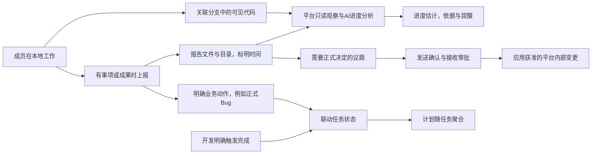

# Judex 详细设计

文档状态：v0.2，本地工作上报与AI办公协同；Q081—Q083已确认完成、AI判断与资料归属边界；会话历史采用SQLite，AI执行采用OpenSandbox。
更新日期：2026-09-24。用户已确认Q021整体业务依据，并要求Demo对齐；新增明确边界为分支用户侧自由组织，平台仅维护计划、任务、Bug修复与分支的关联。记录见QA第23节。目录与部署方式仍为工程建议，详见[AI工作空间](./AI工作空间.md)。
旧执行型设计保存在 [历史稿](./history/2026-09-24-旧执行型详细设计.md)，仅供追溯，不作为现行开发规范。

## 1. 产品定位

Judex是团队成员使用本地AI或手工工作、共享报告与成果的项目办公场所。平台AI持续依据已关联分支的只读代码信息和报告文件判断进度，开发日常不必反复填写百分比或提交进度报告；有结果、材料或需要传达事项时才使用界面、本地AI或CLI上报。真人在平台完成必要的正式审批和明确业务动作。

平台负责项目、计划、任务、机器人任职、讨论、报告、审批、问题和发布回报等内部业务记录。平台对内部状态的生效边界继续按明确规则与人的职责处理，不能将模型的一段判断直接当作已经发生的现实工作。

成员的本地工具不受平台远程控制；本地开发、分支创建/同步/合并、代码修复、测试、发版、升级和运维均由成员自行完成。CLI/API 是上报和获取授权上下文的入口，不是远程执行代理。

## 2. 最新确认与被替代规则

| 问题 | 当前决定 |
| --- | --- |
| Q066 | 每个岗位机器人必须绑定真人；暂时没有其他任职者时由项目主管承担，不能保留无人负责的机器人 |
| Q067 | 岗位经验和工作要求随机器人，个人表达偏好留给本人 |
| Q068 | 分支差异与同步由开发在本地处理；平台只关联计划、开发/修复分支信息并提醒 |
| Q069、Q078、Q082 | AI按报告和时间自行判读并更新进度/疑点；纯推断不直接撤销人工完成，历史验收不改写 |
| Q070 | 延期仍阻塞有序首发；正式批准取消前序后，可以调整后序依赖再继续 |
| Q071 | 实际工作由人员本地AI或手工完成；平台接收上报、监控检测、提醒建议、模拟办公协作并管理内部决策与状态 |
| Q072 | 开发提供技术依据，测试判断测试结果和缺陷性质，经理/主管提出范围与风险处置；平台审批按既有规则生效 |
| Q073、Q080 | Bug可关联多个任务，由一个协调机器人推动整体处理，各任务责任人负责自己的部分 |
| Q074 | 修复批次可以并行开发测试，正式补丁依次形成；后批应包含前一完整补丁，实际代码整合由本地完成 |
| Q075 | 旧“平台何时合main”的问题撤回，按新的上报边界重审，不默认沿用平台执行方案 |
| Q076 | 授权本地AI/CLI直接记入本人上报台账并标明来源；不代本人正式审批，不越过职责权限 |
| Q077 | AI判断进度；计划与任务关联分支，关联可手动或由本地AI登记；开发手动完成，测试Bug直接联动任务，计划随任务聚合 |
| Q078、Q083 | 报告主要放在Judex项目资料目录，按项目/计划/任务组织并标明时间；本地AI直接上传，仓库报告可作只读引用 |
| Q079 | 允许只读Git连接；平台仍不写入仓库或执行本地工作 |
| Q081 | 开发明确完成后进入待测试，测试通过后最终完成，计划随任务聚合 |
| Q084 | 业务会话随岗位交接；正式议题、报告、可共享依据向团队开放；前任个人提示词和私人配置不因交接自动暴露，其他会话沿用既有权限 |
| 本轮工作空间要求 | 上传材料绑定稳定机器人并由接任者继承；会话历史使用SQLite；AI在OpenSandbox执行；用户目录与优化建议分开记录 |
| Q085（用户补充） | 保留计划/任务/Bug修复的分支关联；不强制分支命名、来源、父子关系、阶段切分或合并规则，平台不操作分支 |

以下旧描述不再有效：普通complete上报自动合feature；平台AI修冲突并推送；验收后平台自动创建release分支；平台批准后合main；平台自动移植补丁；平台创建/初始化远端仓库；强制feature/release/bugfix命名或要求任务分支从某指定分支切出才纳管。历史保留于QA，现实动作由本地执行，分支关联不再承担来源资格审查。

原有有效原则继续保留：项目共享事实、不同岗位职责视角、同岗多个独立机器人、兼岗、真人一票、正式报告发送与接收确认分开、ANY/ALL、首票计时、结束只读、变更版本留痕、任务开发完成与人工验收区分、工作与部署记录分开、补丁目标由人选择、历史正式版本记录不可覆盖。

## 3. 平台与本地的职责

| 能力 | 成员本地 | Judex平台 |
| --- | --- | --- |
| 项目与计划 | 提供目标、方案和工作报告 | 立项、讨论、形成计划/任务建议，按确认结果维护内部记录 |
| 开发 | 修改代码、运行工具、创建分支、push/merge、解决冲突；明确触发完成动作 | 持久关联计划/任务分支，只读分析代码与材料估算进度，不要求日常手填进度 |
| 版本同步 | 开发自行选择具体操作、处理差异和验证 | 展示前后序关系、提醒缺少同步信息，记录本地结果 |
| 测试 | 人工或本地AI执行测试，有问题时通过界面/授权本地AI提交Bug和报告 | 正式Bug入账即联动关联任务状态，计划随任务聚合；不再额外走一轮正式报告审批 |
| Bug与补丁 | 在用户选择的版本中修复、适配、复测、形成补丁 | 保存目标选择、批次范围、每目标上报和审批，不操作代码 |
| 发布部署 | 运维使用本地AI或手工部署、升级、回退 | 接收计划/分支/版本/环境的发布结果；记录状态、偏差和待处理事项 |
| 仓库与接入 | 配置本地Git身份和执行权限，可手动/通过本地AI登记分支关联 | Q079已允许只读连接，维护仓库/计划/任务关联并分析可见代码，不申请代码写权限 |
| 文档与运营 | 本地生成报告、网页、图片和数据分析 | 保存内容和来源，AI辅助解读、讨论与后续业务决策 |

平台批准某项工作，不证明成员已经执行；成员上报某项现实工作已发生，也不证明平台审批已经通过。两种事实分别保存。

## 4. 日常闭环

只读分析、明确业务事件、正式议题审批是三条不同路径，不把每次代码观察或普通Bug上报都串成“AI草稿—发送—ALL同意”。Q081已确认开发完成后待测试，测试通过才最终完成；Q082明确AI仅凭推断不重开人工完成状态。正式Bug、本人退回等明确业务事件仍联动任务和计划，所有联动仅更新平台内部记录。

收到报告即可保存原文件、来源和时间，AI自行整理和判读。授权上报直接进入本人台账；正式Bug在有效关联与权限满足后联动任务和计划。关联缺失或材料不足时保留报告并提示补充；正式审批仍独立，不能把入账当作本人已投票。

## 5. 项目、岗位机器人与真人

项目中可以配置多个相同岗位机器人，例如后端开发1、后端开发2。每个机器人独立绑定成员，同一人可以兼岗。项目资料保持共享，机器人承接岗位责任、工作上下文、知识和待办；真人承担当次提交、确认、批准和验收的责任。

机器人不能没有配置人。替换任职者时必须同时指定新成员；人员暂时撤下且没有其他人选时，由项目主管立即承接。主管本人离任前必须先转交主管职责，不能造成最后一个负责人缺失。主管兜底不能被写成AI自行代理人类决定。

岗位知识和岗位工作要求随机器人保留；个人表达偏好仍属于真人。个人配置中需要转成岗位知识的内容应显式沉淀，不能自动复制前任全部个人提示词、私人凭据或本地AI会话。

历史记录保存当时机器人、任职关系和真实操作者。换人不改写旧评论、批准、验收或部署回报。

依据原Q025/Q036：本轮接收机器人与真人的任职映射变化时，确认新版并重新收票，新版等待首票；同一真人承担多个机器人责任仍一票。已结束审批只读，无关岗位换人不使其失效。这里是旧审批规则在新身份模型下的适用，不新增投票份数。

## 6. 上报与来源

上报用于本地已有事项或材料：例如测试发现问题，让本地AI推送Bug及报告；运维部署完成后说明版本、访问地址和结果。开发有材料时也可上报，但日常进度以关联代码与材料的AI分析为主，不要求每次提交代码都另写进度报告。计划和任务的分支关联可手动登记，也可由有权限的本地AI登记。

建议公共信息包括：项目、提交者、关联机器人、来源渠道、任务/计划关联、工作时间、收到时间、报告正文、相关产物、报告版本和幂等标识。代码类可附仓库、分支、提交；测试可附实际环境与当次发布记录；发布可附版本、分支、环境、结果和说明。字段按事项逐步呈现，不强迫运营报告填写Git信息。

Q076已确认：授权本地AI/CLI上报直接记入本人名下台账，标明渠道和来源，不必再回网页重复提交。同一职责权限适用于界面、CLI和本地AI；上报不代替本人正式审批，也不能越权。开发完成需本人明确触发，不能由平台看到代码变化后推断本人已宣布完成。

Q078/Q083已确认：报告主要放在Judex项目资料目录，按项目、计划、任务整理，标明时间，本地AI可以直接上传，仓库中的报告作为只读引用补充。AI可直接读取、关联和判断，不逐份增加读取前审批，也不要求测试/运维为上报先操作Git。建议分别保留工作时间、提交时间和平台收到时间。用户进一步给出plan下repos/resources/talks结构，具体优化见AI工作空间文档。

原始报告和解析结果分开保存。平台可以提取结构化字段，但提取不等于核验。来源信息至少区分：

| 信息 | 表示什么 |
| --- | --- |
| 成员上报 | 某人在某时声明本地完成了这些工作 |
| 外部只读观察 | 在实际具备只读连接并查询成功时，观察到某个分支/提交等事实 |
| AI分析 | 根据当前材料作出的推测、摘要、进度估计、疑点或建议 |
| 人工业务确认 | 有职责的人对某份报告、结论或平台变更作出决定 |

没有实际查询时不显示“Git已验证”；有提交也不等于功能验收通过。人工接受报告不改写其原始来源为外部已核验。

## 7. AI分析与内部状态

平台AI可以读取授权的项目目标、岗位知识、报告、代码信息与产物，按议题进行有界讨论，形成总结、疑点、状态建议和具体变更清单。预算、轮数、重试和暂停规则继续保留；AI发言与真人发言分开。

Q077明确了三类生效方式：

| 类别 | 当前规则 |
| --- | --- |
| AI进度与材料判读 | AI依据关联分支、任务目标和目录材料自动判断进度、整理信息；显示依据及分析时间，不要求开发反复手填百分比 |
| 明确业务事件 | 开发本人触发开发完成后待测试；测试通过后最终完成；正式Bug或本人明确退回联动相关任务，计划跟随任务 |
| 正式办公决定 | 计划范围、取消、风险接受等仍沿用相应审批；本地AI上报不代表替真人投票 |

AI估计的进度和人的完成动作分别保存。Q082已确认：AI自动更新进度分析和疑点提醒，仅凭推断不直接撤销人工完成状态；正式Bug、本人退回等明确事件按规则联动。不能把AI判读写成人已完成、测试已验收或已投票，历史决定继续保留。

当前Demo已区分正式计划审批和普通上报：Bug/测试事件按职责直接联动，普通工作说明不会变成完成操作；开发通过任务卡片明确完成。分支观察使用标明模拟来源的输入，更新AI估计而不撤销人工状态；尚未连接真实Git或模型。资料目录已有浏览器演示，SQLite/OpenSandbox等后端能力未接入。

审批通过可以创建平台计划、任务和内部待办，不能创建远端仓库、修改代码或执行部署。代码和部署的具体动作改为由本地人员处理并再次上报。

## 8. 审批与办公流转

既有边界继续有效：平台AI可选择接收职责和层级；配置节点强制结论层。正式报告冻结内容、变更清单、接收责任和真人映射。发送方真人确认发送后，接收方按ANY/ALL处理；同真人去重，首位同意开始计时，项目超时规则记录独立来源。

待处理轮次的有效反对使本轮失效并继续讨论；内容或名单改版重新收票。已结束审批关闭按钮，拒绝旧版本请求，不用事后反对入口撤销已发生现实工作。

批准的对象必须写清：认可了什么报告、允许平台应用什么内部变化、下一步由哪个机器人及成员处理。界面不得把“报告已通过”写成“代码已合并”“环境已部署”。

现实工作可以早于上报，平台无法据页面状态阻止本地操作。运维部署回报按授权直接入账，AI结合目录报告、时间和只读信息判断现状；若与内部批准不一致，显示疑点并保留现实回报和审批历史。Q082不允许仅凭AI推断直接撤销人工完成状态。

## 9. 计划、任务与有序版本

开发和测试可并行；正式首发按版本先后，后继应包含前序已发布功能。成员本地完成代码整合与发布，平台保存依赖关系并依据上报及可用观察检测是否缺少前序成果、提醒相关人员。

计划建立时可以登记计划关联分支，下属任务和Bug修复分别登记自己的关联。手动和授权本地AI/CLI使用同一关联模型：对象类型及ID、仓库、分支、来源、登记人和时间。新建计划草案可以列出分支关联，经正式审批后只生成平台元数据；已有对象也可从详情维护关联。

**用户已明确分支自由组织**：不要求feature/release/bugfix前缀，不验证必须从main或某计划分支切出，不以祖先关系、父分支或合并方式作为登记门槛。同一仓库分支可以关联多个计划/任务/问题，一个对象可以关联多个仓库分支。对象权限、项目归属、非空字段和重复关联属于平台信息校验，不是Git流程约束。

计划、任务、Bug修复三类关联分别保存，不能把计划分支自动当作全部任务或全部修复的分支。解除关联只修改平台记录，不删除、重命名或修改远端分支。登记关联不代表已获得仓库读取权限或完成核验；无真实连接时应显示未观察/模拟观察，不能伪造来源证明。

平台通过已授权只读连接分析实际可见代码，结合任务目标、验收条件和材料判断进度；只有成员电脑上而未同步到可读仓库的变化，不算平台已经观察到。界面显示最后观察/分析时间和依据，读取失败显示待更新或未核验，不因断连把进度归零。分支存在、提交数量或一次合并不能单独证明任务完成。

平台不准备同步代码或处理冲突。关联歧义提示核对，材料不足给出不确定性；多个任务共用代码时按各任务目标独立分析，不简单复制同一个百分比到所有任务。

延期仍保持顺序约束；正式批准取消前序后，在内部变更记录中明确后序依赖、缺失范围及后续责任。实际已合代码怎样处理由开发本地完成，平台记录上报，不执行撤销或回滚。

Q081已确认继续区分开发完成与最终验收完成：开发明确完成后进入待测试，测试通过后任务最终完成。AI不能凭估算自动完成；计划随任务状态聚合，测试Bug或本人退回等事件可重新进入修复，旧验收历史保留。

计划整体状态跟随任务状态，不要求经理另点一次计划完成。测试正式Bug联动任务修复后，计划按有效工作聚合；暂停、取消和阻塞原因仍独立保存。AI进度评估与任务生命周期分别呈现，不用固定百分比代替业务状态。

## 10. 测试、Bug与多任务关联

测试由人员在本地手动或借助本地AI执行。可直接在界面上报，也可告诉本地AI“某任务有问题、报告是什么，请推送平台”。测试只需要表达任务、环境、现象、预期和证据，不负责分析内部Git依赖。

任务关联表示业务影响；实际测试对象由这次测试报告中的环境/版本/产物定位。测试环境更新不能改写旧反馈。没有足够定位信息时保留报告并提醒补充，不能假定它测试了当前最新代码。

Q080已同意：一份Bug关联多个任务，由一个协调机器人负责收齐信息和推动整体处理，各任务责任人处理自己的部分。协调机器人不是唯一主任务，不代其他人员完成修复或验收。

已确认正常/异常路径仍保留，但动作来自人员上报与平台内部确认：

- 有职责的测试人员通过界面或授权本地AI/CLI正式提交Bug，并完成任务关联后，直接建立问题、联动相关任务修复状态和计划聚合；不额外要求“AI草稿—发送—接收审批”才生效。缺少关联的材料可先保留为待补充报告。
- 开发有修复材料时关联本次实际处理的问题，不能把同任务所有Bug笼统判为已修；代码可见变化本身也不等于测试关闭问题。
- 代码处理完毕、测试环境已更新、复测通过分别留证，缺少后一步不能冒充已完成。
- 复测失败回到修复；再次出现保留新报告及旧关闭事实。
- 重复关联原问题；非缺陷保存理由；无法复现或缺资料保留待补充和下一责任。
- 暂缓、不修、取消及范围调整按职责和相应审批处理，不把这些结果显示成修复成功。

测试岗位判断测试与缺陷性质，开发提供技术依据，经理/主管提出范围和风险处置。发起权限不代表可以绕过既有正式审批。这里的“处理”均为平台内业务记录及决策，实际修复/复测由本地执行。

## 11. 补丁目标和维护范围

一个Bug可在多个用户选择的维护线或main上处理，每个目标有独立上报、材料、测试结果、业务确认和未完成事项。允许先处理故障维护线；未选目标不得被AI自动加入工作范围。

本轮维护范围由人确认。范围内A已完成验收可以先发布，范围外B仍开放，原任务/计划继续反映剩余工作；不能因为一个补丁已发布把全部问题关掉。维护工作继续归原计划，不自动创建普通新计划。

同一维护线可并行开发和测试，正式补丁依次形成。两个批次从1.2.3开始，先形成1.2.4后，后批应包含1.2.4再形成1.2.5。代码、分支和版本由本地完成；平台记录成员报告的基线、范围和结果，检测缺少前序信息并提醒，不替开发同步。

平台批准某版本修复意向，不代表补丁已形成；收到版本形成报告，也不代表已经部署。main作为一个可被选择的本地处理目标，不需要平台创造补丁号或自动合入流程。旧Q075执行时序问题由Q071撤回。

## 12. 运维和发布回报

运维本地AI或手工负责测试环境、生产环境部署、升级步骤、版本跨越和回退。Judex不控制如何升级，也不要求它代执行必要步骤。平台接收“对应计划/分支/版本有没有发布、发布到哪个环境、结果怎样”的回报。

发布回报应展示本地操作时间/收到时间、成员、关联对象、环境和成功/失败/进行中等结果。地址是辅助材料，不单独证明运行成功。报告只含声明时明确标示“成员上报”，不是平台实际部署或健康检查结果。

现实回报、平台审批和工作状态独立：旧版本已部署可以与当前任务修复并存，后到的旧回报也可能描述更早的事情。AI按报告、目录和时间自行判读，不要求用户逐份人工选择当前报告；原文件、时间和历史决定保留。按Q082，纯推断产生进度或疑点，不直接撤销人工完成。

## 13. “候选变化”的通俗含义

旧执行型设计把平台准备的一份待发布代码称作“候选”。新定位不需要让测试或运维理解这个词，统一表达为“这份报告对应哪一次工作成果”。

例如上午测试上报“任务T在提交A测试通过”，下午开发上报“同一任务又修改到了提交B”。平台收到的是两份指向不同成果的报告。上午的通过仍然是历史事实，但不能自动写成B已经测试通过。

Q078/Q082明确AI可按目录报告和时间梳理A/B各自依据、材料新旧及可能影响，不需要测试逐次解释代码内部差异。它不修改A/B、不替测试重测，仅凭推断不重开人工完成；正式Bug或本人明确退回仍按规则处理。历史上A曾通过的记录不会被抹掉。

这同样适用于网页、文档、设计稿和运营报告，不局限于代码提交。能固定文件版本、报告ID、产物引用时就使用该关联，不强制所有工作都有Git SHA。

## 14. 项目客厅与角色交互

保留项目首页和项目客厅，避免常驻后台模块菜单。客厅围绕“我负责什么、本地上报了什么、平台发现什么、现在等谁确认”组织。

| 岗位 | 默认工作重点 |
| --- | --- |
| 主管 | 目标与范围、待决报告、流程偏差、由自己临时承接的机器人 |
| 项目经理 | 计划依赖、成员上报、状态依据、缺失信息、待分配与协调 |
| 开发 | 关联分支、AI进度及依据、本人完成动作；有成果或事项时上报，不必日常填百分比 |
| 测试 | 关联任务、本地测试结果、通过界面/本地AI提交Bug后的即时状态联动、待复测事项 |
| 运维 | 计划/分支/版本关联、发布结果上报、记录待核对事项 |
| 运营 | 中间与最终产物、运营报告、与项目目标相关的分析及后续讨论 |

共同报告保持一份，个人解读只辅助阅读。显示焦点不改变权限，全部待决不会被职责筛选隐藏。主管接替机器人后按所承担责任看到完整待办，但仍按真人计票。

建议入口名称使用“上报本地工作”“查看报告与依据”“分析并提出建议”“确认发送”“确认平台变更”“回报发布结果”。原“自动合入”“AI修复冲突”“执行传播”“创建release”等执行入口从当前Demo撤下。

目标交互：计划/任务详情提供关联分支和AI进度依据；开发完成后待测试验收；正式Bug提交后直接展示任务/计划联动；资料区显示文件、目录、时间和机器人归属，AI结论可回到原材料。按Q084区分可继承业务会话、团队正式材料和受限个人配置，正式待决只包含需要人的办公决定。

## 15. 接入、内容和工程边界

Skill提供本地办公协议说明，CLI处理登录、上传、来源、重试和结果查询，API负责鉴权、幂等、版本和内部状态。它们都不能因文字报告声称获准而扩张为外部执行通道。

内容包含文字、图片、网页、文档和代码引用，应保留原始报告、解析结果、可见范围和引用关系。交互网页预览与平台登录态隔离。当前新Demo可实现到什么程度，以Demo.md列明的实际范围为准，不沿用旧原型的能力声明冒充新实现。

Q079已确认只读Git连接，结合Q077用于关联分支分析。用户本轮确定平台AI在OpenSandbox执行：可以在隔离环境中运行获准的资料读取、检索、解析和办公分析工具，但不因此恢复客户项目开发、构建测试、Git写入、部署或远控能力。没有凭据或资料不完整时，显示未核验/待更新，不编造读取结果。

用户已确定会话历史用SQLite，报告主要归平台项目资料。建议SQLite由服务持有并通过API提供获准上下文，持久数据独立于沙箱生命周期；代码/既有资料只读，运行输出与临时文件使用独立写目录。目录与部署建议、官方依据及已确认的交接/共享边界见[AI工作空间](./AI工作空间.md)。其他业务数据库不由会话历史选型一并确定。

后台任务用于分析、解析、通知、审批超时和内部业务一致性；预算、取消、重试、去重、审计和权限执行仍然需要，但不再承担现实Git/部署作业恢复。

遵守AGENTS：桌面Web、中英文、深浅主题、统一组件与token、judex-*类名前缀、前后端单文件不超过2000行。语言偏好继续使用argus.locale。

## 16. 新旧规则迁移和Demo验收

旧详细设计已归档，QA保留原始答复及被Q071替代的原因。当前规范以本文件为准，不能继续用旧“平台先批后推”“complete自动合feature”规则驱动业务。

当前Demo改用独立办公数据模型与存储，原执行型演示代码/测试保留为历史参考，当前入口不再挂载它。新原型只模拟收到报告、AI分析与内部办公状态，不访问真实Git、模型、CLI服务或部署环境。旧浏览器数据不用于证明新流程已执行。

当前Demo已完成：计划/任务/Bug修复的持久分支关联、任意名称/多仓/跨对象复用、只解除关联不动分支；模拟只读观察驱动AI估计；开发本人完成后待测试、测试通过最终完成；正式Bug直接联动及协调岗位；报告目录、1MB内文本/图片业务资料上传和岗位交接。数据使用独立judex.office.v2，旧数据保留。真实模型、Git、CLI/API、后端文件存储、SQLite与OpenSandbox未接入，Demo不能作为这些集成的证明。

当前验收应覆盖：

1. 创建项目、岗位必须有人、主管兜底、同岗多个机器人及个人/岗位配置分离。
2. 本地工作上报留存来源和材料；报告中的分支/提交是引用，不触发写操作。
3. 开发完成与测试验收分开，多任务Bug能保留关联与失败报告。
4. AI建议、发送确认和接收审批分开；ANY/ALL、真人去重、改版、结束只读正确。
5. 审批通过只更新平台内部记录，不能自动合并代码、生成真实分支/版本或部署。
6. 实际发布回报可与待审批、任务修复并存，不因平台流程状态拒收成员声明。
7. 更正报告和任职映射变化不能沿用失效审批，旧记录保留。
8. 当前入口、中文/英文、深/浅主题的桌面流程可操作。

本轮生产构建、24项状态测试、8条浏览器E2E已通过，覆盖分支关联、明确完成/测试与Bug联动、AI不撤销人工状态、资料上传与岗位交接、中英深浅桌面。SQLite恢复、沙箱只读挂载和真实集成验收仍待后端实现；范围详见Demo.md，不用浏览器模拟声称后端已实现。

## 17. 已确认边界与整体理解

Q021整体摘要已获用户确认，本轮直接实施Demo，不再重复申请许可。用户随后明确的分支自由组织与关联边界记为Q085已确认补充，不是新提问。旧执行型方案和强制分支规矩不再作为实施依据。

目录名、数据库分片、SQLite服务访问、沙箱复用和缓存布局仍是工程建议，不能把用户对Q084的答复扩大成批准全部实现细节。资料可见性按实际职责和内容权限执行，不把原始工作会话默认全部公开，也不声称用户逐字选定了某个排他角色清单。

已确认业务规则、工程建议和实际实现状态分别记录。现有Demo与生产接入仍有第16节列出的差距；产品分叉收敛不代表功能、部署或验收完成，原已授权Demo范围也不需要因Q021校对而重新申请许可。
