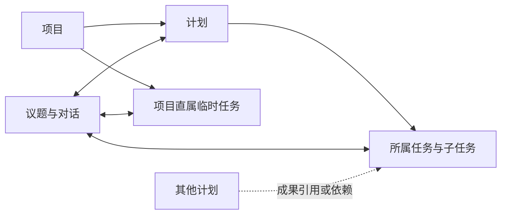

# 灵感工作室：计划、任务与协作界面方案

日期：2026-09-25。状态：本轮页面重构依据。用户后续已授权完善 Demo，并在必要时制作多个 ToC 版本；现已形成三套可操作比较原型，见 [新版 Demo 方案对比](./新版Demo方案对比.md)。以下描述设计目标，实际覆盖与模拟边界以对比文档为准。

业务依据为 [产品主线](./产品主线.md) 和 [Q001～Q055 答复](./重新设计讨论.md)。计划/任务归属、人的决定、交接与异常处理已确认；本文的菜单名称、布局、视图切换和操作组合属于界面建议，不自动视为用户已批准的页面实现。

## 1. 本轮调整的目标

保留灵感工作室的自然色、项目封面、亲和的成员呈现和对话体验，让用户同时看清三件事：这一阶段要交付什么、有哪些具体工作、哪些问题需要讨论或决定。

- 计划记录阶段目标、范围、完成条件与负责人；负责人同时做整体验收并更新正式计划状态。
- 任务记录具体成果、关联的任职身份、交付与验收。一个任务最多归属一个计划，临时任务可直接归项目。
- 议题记录讨论、资料与提案，可关联多个计划或任务。结束议题不增加交付进度。
- 职位模板由用户定义，同岗可多人；成员以“人名 · 职位”显示，背后是可持续替换关联人的工作身份。
- AI 参考流程建议协作与推进；人确认发送、接收、验收和正式变更。代码检查权限、版本和明确批准的硬性条件。

图中归属关系与关联关系分开。跨计划引用打开同一条任务及其验收记录，不复制任务，不将被引用任务直接计入引用方的所属任务完成数。

## 2. 页面入口建议

工作室级入口保留“我的工作台、项目、待我决定”。项目内使用稳定的工作入口，管理配置放在有权限的人可见的位置。

| 入口 | 主要内容 | 使用方式 |
| --- | --- | --- |
| 我的工作台 | 我负责的工作、待发送、待接收、待完善、待验收 | 从“我现在需要做什么”进入原工作或卡片 |
| 待我决定 | 计划/任务草稿、范围调整、分派变更、其它正式提案 | 沿用具体内容版本与实际审批权限，不把普通聊天当决定 |
| 项目概览 | 目标、当前计划、近期交付、待处理问题、成员动态 | 给出业务概况，AI 分析与人的正式状态分开展示 |
| 计划 | 阶段目标、负责人、范围与完成条件、任务树、依赖、整体验收 | 作为阶段性交付的主要入口 |
| 任务 | 项目内统一任务视图，按计划、本人、职位、条件筛选 | 临时任务标为“项目直属”，可直接找到，不伪造一个默认计划 |
| 议题 | 项目讨论及关联计划/任务，Chat、资料、审批卡、输入框 | 从问题进入协商，也能跳回受影响工作 |
| 资料 | 原始材料、用途、来源和已确认关联 | 保留自由提交与人工确认关联规则 |
| 成员 | 人员及承担职位、相关工作；本人项目提示词入口 | 显示当前关联人，保留稳定任职身份与历史操作者 |
| 项目设置 | 流程与硬条件、职位模板、节点挂载、成员邀请、管理角色 | 创建人和管理者可见相应配置；配置权不自动扩大业务审批权 |

“待发送／待接收／待完善／待验收”是工作台待办分类，不是一条任务状态链。同一个任务可以同时有已接收和待完善的不同来源，卡片引用各自具体交付版本。

普通成员主要进入自己的工作、相关讨论和本人提示词。计划负责人能看到其计划的整体验收与状态更新操作；项目管理员看配置入口。页面可见与动作可执行均按实际授权过滤，不只隐藏按钮。

## 3. 计划页建议

上方集中呈现阶段目标、负责人、范围、完成条件和正式状态；中间是所属任务树；旁侧或下方呈现依赖、引用成果和需负责人处理的事项。

建议提供“任务树／依赖关系”两个视图：树表达拆分，依赖表达先后条件。同级任务可并行，排序不构成前置。项目流程图是可复用的协作参考，不与这份计划的实际任务依赖图混为一张图。

计划进度可以显示“已验收任务 3/8、待接收 2 项、有 1 项交付需完善”等事实。AI 可以分析阻塞与下一步，但正式计划状态继续由负责人更新；不能按议题结束数或一个平均百分比宣布完成。

整体验收入口汇总任务成果、验收依据和计划完成条件，交给计划负责人。复用已有任务证据，检查整体目标，不让用户把所有任务再验收一遍。

已完成计划中出现任务重开时，显示重开事实和“整体结果需负责人复核”的提示。保留原计划验收记录，计划当前正式状态由负责人决定，不自动整棵树回退。

## 4. 任务页建议

任务详情集中展示交付目标、所属计划或项目直属标识、关联任职身份、完成条件、前置与后续工作。多入口打开同一任务，议题只是关联讨论之一。

需要分开展示以下信息：

| 信息 | 说明 |
| --- | --- |
| 正式工作状态 | 来自有权用户的手动操作或授权本地工具上报 |
| 流程环节与下一步建议 | 已确认推进记录与 AI 建议分别标明，未确认建议不装作已经执行 |
| 当前交付与来源 | 每份内容是谁提供、谁确认发送、属于哪个版本 |
| 交接进展 | 待发送、待接收、已接收或拒收反馈；可逐来源处理 |
| 最终验收 | 对应完成条件、验收权限、决定与记录；普通接收不自动成为最终验收 |
| 相关议题 | 需求澄清、问题分析、范围调整等原有 Chat 的关联入口 |

操作文案建议明确区分“提交本环节成果、确认发送、接受交接、拒收并说明、确认任务验收、重新打开”。这些名称用于表达不同业务动作，不意味着所有任务都要经过同样多的按钮。若组合动作，需明确显示其效果、满足各自权限并分别记录。

本地工作简报提供当前目标、已有决定、相关资料、流程依据和本人有权使用的提示词，供成员主动获取。提交状态或报告后在页面回显本人、工具来源与时间，不把平台 AI 的分析伪装为成员已经上报的结果。

## 5. 推进卡片建议

同任务换环节与跨任务依赖推进共用卡片风格，但必须明确是哪一种。双方看到同一份推进记录，通过不同入口操作。

建议卡片包含：

- 正在交接的任务或环节、发送人、接收人及各自职位。
- 依据的流程名称、节点、版本，以及 AI 建议这样推进的理由。
- 各来源的交付内容、版本、发送确认与接收结果。
- 已满足和未满足的明确硬条件；未满足时解释哪一项阻止当前操作。
- 当前可执行的明确动作及相关历史。

例如汇总卡可以显示：

| 来源 | 内容 | 发送确认 | 接收反馈 |
| --- | --- | --- | --- |
| 林然 · 内容策划 | 文案 v2 | 林然已确认 | 已接收 |
| 周宁 · 视觉制作 | 图片 v1 | 周宁已确认 | 拒收：需补充指定尺寸 |

以上职位和姓名只是示例。周宁补交图片 v2 后，只重新核对变化及其影响；文案未变化且未受影响时保留接收。某个来源已接收，不代表整个下游的必需前置均已满足。

发送后进入待接收，明确接受才完成交接；拒收回到对应发送人完善。接收超过项目配置时限仍保持待接收，提醒接收人与计划负责人，不使用共同审批的超时默认同意规则。

新版流程直接进入后续提示词。若实质改变旧卡的接收对象或交付要求，显示变化，形成更新建议，发送人确认后再交接收人；保留旧版本和旧决定，不让旧卡悄悄变成另一项承诺。

## 6. 成员、职位和流程设置建议

成员列表显示人名及其承担的职位，一人可有多个职位，同职位可有多位成员。查看具体任职身份时聚合其工作、讨论和可访问业务记录。

职位模板维护职责提示词与“流程／节点”挂载。成员自行配置本人的项目提示词。模板职责、稳定任职身份、当前关联人和个人偏好在数据及展示上分别表达；旧人的个人配置不随替换公开。

新增同岗成员与替换既有任职身份的关联人是不同操作。替换保留原工作的业务身份与记录，历史实际操作者不改写。当前承接人变化与把工作改派给另一个任职身份应明确区分，后者属于正式分配变更。

AI 消息、人的发言、本地工具上报和正式决定保持来源标签。即使以“人名 · 职位”呈现，也应明确该内容来自该职位 AI 的分析，不能让 AI 的话看起来是本人已经作出的承诺。

流程设置建议采用“对话＋图＋环节说明”联动视图。用户通过对话修改，AI 形成明确规则，Mermaid 图与说明由同一来源生成，经人确认同版发布。

环节说明分清：

- **协作参考**：推荐路线、适合参与的职位、分析方法与所需背景，供模型结合实际判断。
- **已确认硬条件**：用户明确确认的、可校验的必需前置或资料要求，代码检查并解释未满足项。

不能从某条图形连线或“必须”这个词直接产生未经确认的硬条件。代码验证明确记录、权限和条件，内容质量仍需 AI 分析与人验收；图也不代表平台会操作成员电脑。

## 7. 下一版软件示例建议

保留“轻笺”作为用户可修改的研发示例，组织为“首版交付”计划，包含如“实现清单功能、完成使用说明、整理交付包”等成果任务。职位名称、人数与流程均作为示例配置，不固化为平台功能。

研发场景可展示实际关联的仓库、分支、提交和本地报告，作为交付依据与分析线索；分支命名由用户决定。平台不据此创建、合并分支或执行部署，不把研发字段强加给其它领域。

建议让示例同时展示：

1. 一个计划的任务树与可并行分支，以及一个项目直属临时任务。
2. 一个纯讨论议题，如是否把标签能力纳入后续范围，不计入当前交付进度。
3. 多来源交付汇总，其中一个来源拒收并补交，其它已接收内容保留。
4. 发送方确认、接收方明确接受、任务最终验收与负责人计划验收的区别。
5. 新版流程改变某张待接收卡的要求，需要重新确认改变后的内容。
6. 已验收任务由有权人重新打开，历史保留，计划负责人看到整体影响提示。
7. 管理者、执行成员、接收成员和计划负责人从各自入口查看同一工作。

具体任务依赖和硬条件在示例中写清楚，避免“必须最终验收才可进入验收工作”之类自相矛盾的循环。示例资料依然明确标为虚构，不宣称已连接真实仓库、CLI 或部署环境。

## 8. 后续实施验证范围

以下是方案形成时列出的实施验收目标。本轮已实现其中的核心前端路径并验证，具体已测项及未实施范围见 [Demo 工程说明](./demo/README.md)，不将清单全体视为生产验收已通过：

- 项目、计划、任务、议题分别存在；任务唯一计划归属、项目直属任务、跨计划引用不复制工作。
- 草稿经有权人确认形成工作，普通聊天及纯议题结束不改变交付进度。
- 各来源分别确认发送，明确接收才交接完成；接收未回应只提醒协调。
- 局部拒收只回退相应未验收交付，补交保留不受影响来源，必要的后续推进被正确暂缓。
- 来源变化、流程新版和旧卡处理保留实际审阅版本，不以旧决定批准新内容。
- 普通接收不隐式最终验收；负责人整体验收后更新计划；重开保存历史并提示影响。
- 硬条件和真实权限在操作层检查，普通路线由 AI 建议；不能只在界面隐藏按钮。
- 稳定任职身份、换人、个人偏好隔离、多角色实际操作者与真实消息来源保持一致。
- 中文/英文、深浅色和桌面布局沿用统一组件与 design token。

真实模型质量、服务端权限、CLI 身份授权、并发/重复请求和后台提醒，仍需要后端实现及运行验证。当前旧 Demo 的测试不能代替这些验收。
