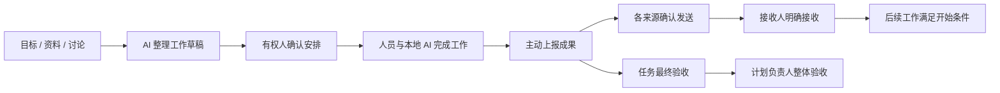

# 02 业务对象与协作流程

## 1. 对象与不变量

| 对象 | 必须保持的含义 |
| --- | --- |
| 项目 | 工作、资料、流程、成员与身份的授权边界 |
| 计划 | 阶段性交付，包含目标、范围、完成条件和负责人 |
| 任务 | 可独立交付的工作，最多一个所属计划；可直接属于项目 |
| 父子任务 | 工作拆分，不自动表示先后顺序或相同状态 |
| 前置关系 | 经确认的开始 / 验收条件，独立于父子关系 |
| 议题 | 讨论与结论；结束议题不增加交付进度 |
| 工作流程 | 人工发布的规则、图与节点职责；AI 的协作参考 |
| 提案 | 对正式工作或结论的可审阅变更草稿 |
| 交接 | 按来源确认发送、由接收方明确接受的过程 |

跨计划复用引用原任务与原验收，不复制一份进度。同项目内议题可以关联多个计划和任务，各入口看到同一份记录。

## 2. 建议状态模型

以下枚举是实现方案，业务含义源自已确认规则；不是将模型分析结果直接写成正式状态。

| 对象 | 建议状态 |
| --- | --- |
| 计划 | draft → active → accepted；负责人可按授权恢复推进 |
| 任务 | draft → ready → working → delivered → accepted；未最终验收可进入 rework，重新上报后 delivered |
| 提案 | draft → pending → approved / cancelled；依据过期时停止旧版本生效，另建修订 |
| 交接来源 | draft → pending → accepted / rejected；补交递增来源版本并重新确认发送 |
| 议题 | open / closed，独立于工作状态 |

`blocked` 建议作为由条件计算的当前阻塞信息，不与工作阶段互相覆盖。AI 进度分析另存，不直接撤销人工验收。

## 3. 正常路径

交接接收与来源任务最终验收是不同记录；开始后续工作的具体条件以已确认约定为准，不统一强制“所有前序任务最终验收后才能交接”。

## 4. 提案、部分接受与多人共同审批

设计方案：一个 `proposal` 表达一个需要共同决定的问题，包含不可变的审阅版本和审批位；多个独立问题可组成一个展示包。

- 整体 / 部分接受作用于可独立成立的问题或事项，不代表同一问题只需部分审批位同意。
- 相互依赖的事项展示依赖，必要时作为同一原子应用组；缺少必要同意时不能应用矛盾的子集。
- 同一问题所有指定审批位满足同意后才正式应用。依规则产生的超时同意和获授权代批是不同来源的满足记录。
- 首人同意后开始计时，后续同意不重置；项目默认、环节可调整。24 自然小时仍是建议值，未锁定。
- 审批期间任一人退回须说明原因，该提议取消，终止计时和剩余待批。
- 修订另建审阅版本 / 新提议，不继承旧同意与计时；明确停止方向时不得自动反复重提。

同意前服务端核验审批位、当前绑定、审阅版本、证据版本和依赖。依据改变时明确提示差异，不能将同意自动套到新内容。

多人审批超时与交接未回应不同：后者始终保持待接收，只提醒接收人和计划负责人协调。

## 5. 退回、补交与验收异常

| 事件 | 必须行为 |
| --- | --- |
| 接收方拒绝某一来源 | 要求原因；尚未最终验收交付退回待完善；仅相关后续受阻 |
| 发送方补交 | 新来源版本、保留原文与原决定，重新确认发送 |
| 其他来源未变化且未受影响 | 保留已有接收，不整包清空 |
| 补交实质影响其他来源 | 标明影响范围，相关人重新复核 |
| 已最终验收任务发现问题 | 当前有权验收人确认重开，原验收保留；新范围新建任务 |
| 任务重开涉及已验收计划 | 提醒负责人重新判断，不能自动撤销计划历史结论 |
| 流程发布新版 | 后续模型调用用新版；旧卡无实质影响则继续，有影响则形成修订并重新确认改变部分 |

## 6. 计划与任务树

树根为计划，父子拆分从左向右；支持多个孩子，不限制二叉。归属实线与前置虚线箭头分别表达。

提出子任务至少明确所属计划、父任务、交付目标、参与身份、流程和验收职责；初始为草稿。新增、调整依赖和分工属于正式安排变更，需要相应提案确认。

计划完成要求负责人对照目标和完成条件作整体验收。任务进度可聚合展示，但不能自动将计划设为已验收。复用任务已有证据，不重复执行每个任务的验收过程。

## 7. 业务事件与幂等

设计方案：每次正式命令在单个数据库事务内完成权限复核、版本校验、状态更新、审计记录和后续任务登记。外部模型、沙箱与文件传输不放入长数据库事务。

上报、发送、接收、审批使用稳定幂等键；相同键和载荷重试返回原结果，相同键不同载荷拒绝。工具超时、网络断开或队列重试不能重复批准。

对同一审批位的人工提交和超时处理使用数据库并发控制，在状态 / 版本条件上竞争，保证只有一个有效结果。不得仅凭前端按钮禁用或进程锁保证一致性。

## 8. 尚待细化

任务类型扩展、Bug 的专门界面、跨计划图编辑、计划取消 / 归档 / 删除、审批决定撤回、审批位与职责临时调整、所有负责人失联的恢复方式没有被本轮补齐，见待定事项。不可引入 V1 的版本号发布顺序规则填补空白。
