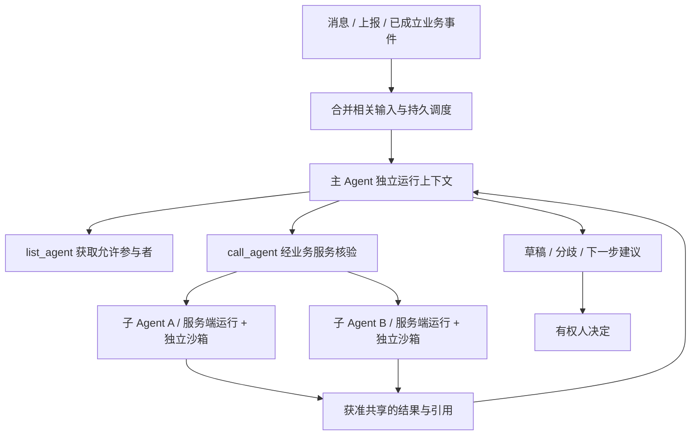

# 06 Agent 执行与上下文

## 1. 已确认与参考范围

参考 pi 的四工具、工具循环、上下文组装与压缩机制；Judex 的其他业务 Agent 工具单独实现。不将上一轮“直接复用 TypeScript pi 包”的建议作为选定方案。

设计方案：自研 Go harness 在 judex-server 服务端执行（`internal/agent`，进程内 worker），模型调用经服务端 ModelProvider 完成，模型密钥不离开服务端。经核验 OpenSandbox 为外部驱动架构：客户端在沙箱外经 SDK/CLI/API 创建沙箱并远程执行命令与文件操作，平台提供按沙箱出口控制且密钥不进沙箱；因此沙箱定位为纯执行环境，接收四工具的命令派发，不运行自研常驻程序。用户已明确采用容器沙箱，与 Judex 服务在同一 K8s 集群部署；不等于与业务 Server 共用 Pod。业务服务管理授权、运行登记和恢复；沙箱不持有任何平台凭据（模型、数据库、存储均无），也无直接写业务数据库的权限。OpenSandbox 负责执行环境生命周期，不负责判定工作已经完成或某人已经批准。

## 2. 统一 harness、独立执行

项目主 Agent 是稳定的协调身份，各议题拥有独立会话。子 Agent 以项目内任职身份执行，按同一议题续接，跨议题按权限加载业务知识。

Q068 已确认首期保持中心协调，不开放岗位 Agent 自由互聊。子 Agent 需要其他意见时返回请求，由主 Agent 居中决定。受控讨论小组属于后续验证选项，尚未成为首期必须实现能力。并行执行不共享可变消息数组、临时目录或未经授权的材料。

Q065 已确认：已有任务优先使用正式分配的身份；尚未正式分工的探索讨论，主 Agent 可按职责选择一个或多个获准身份。参加分析不自动成为正式工作分配，不要求同岗全员参加。

Q069 明确首期没有必须接入的外部 Agent 服务。内部不强制采用 A2A，保留执行适配边界，未来接入独立外部服务时再增加适配。A2A 通信协议与中心协调模式并非二选一；协议执行完成也不等于 Judex 任务最终验收。

## 3. 工具分层

| 工具 | 输入 / 输出原则 | 执行边界 |
| --- | --- | --- |
| read | 规范化路径、范围读取、截断信息与来源位置 | 项目共享只读区及本次工作区；不增加项目内逐文件读取授权 |
| write | 文件路径、完整内容、写入结果及产物摘要 | scratch / output 等允许写入位置 |
| edit | 文件、预期内容或摘要、替换内容；不匹配明确失败 | 不能静默覆盖别人的修改或只读资料 |
| bash | 命令、工作目录、超时、输出限制；保存退出状态 | 沙箱内执行，不在业务 Server 或成员电脑执行 |
| list_agent | 项目 / 流程节点 / 所需能力；返回可发现身份与职责 | 不泄露私人提示词和不可发现成员信息 |
| call_agent | 目标身份、议题、问题、允许转交的引用、预算 | 服务端复核节点、权限、绑定及资料受众 |
| publish | 来源路径声明（可空）、工作区产物路径、项目内目标相对路径、修改说明 | 服务端执行：经 SDK 取回产物、写对象存储新版本、登记来源版本与运行身份、发事件；来源版本落后时报错，要求取最新版重做 |
| 其他业务工具 | 查询工作、读取正式规则、登记草稿 / 材料、提出建议 | 工具注册表独立定义能力、授权与副作用类型 |

四工具（read / write / edit / bash）由服务端 harness 经 OpenSandbox SDK（命令执行、文件读写接口）派发到本次运行的沙箱内执行；业务工具（list_agent、call_agent、publish 及登记类工具）在服务端直接执行，不进入沙箱。不得因为希望“只保留四工具”而开放可绕过授权的数据库连接或万能管理员 CLI。四工具控制基础探索方式，业务权限仍由业务服务负责。Q070 经 2026-09-25 修订：结构化执行上下文直接存入 PostgreSQL，ContextBuilder 从 PG 表与内存工作集构建消息，不每轮导出一组上下文文件，也不维护独立 SQLite；深入查询使用受控业务能力。

平台 Agent 凭据不含人工审批能力。成员本地 AI 的本人授权和正式命令是另一条身份路径，详见接口与接入设计。

## 4. 上下文组装

设计层次及优先级：

1. 系统执行契约、不可由材料改写的工具与权限边界。
2. 项目已发布流程、节点职责与当前参与限制。
3. 当前职位的职责与工作要求。
4. 当前绑定人的个人项目偏好，仅在其授权执行中注入。
5. 当前计划 / 任务 / 议题的正式事实、决定版本与待决问题。
6. 当前会话摘要、必要原始消息、已返回子调用引用。
7. 本轮材料、用户消息和需要探索的线索，明确来源。

项目流程与节点信息在每次模型调用中提供有效版本。具体表示可以是结构化规则摘要与可追溯引用，但不能在压缩后遗漏硬性约束或权限变更。

职责和权限高于个人表达偏好。用户提交的文件和仓库内容是分析材料，不是能够改写平台权限的系统指令。

## 5. 压缩与记忆

压缩触发依据模型上下文上限、输出预算、工具结果体积和安全余量，具体阈值待模型适配验证，不直接照抄固定比例。

必须保留：当前目标、正式决定和引用版本、分歧、未解决问题、等待的人类决定、子调用状态、下一步及材料来源。不能压缩掉某人的反对意见后将“摘要没有反对”解释为一致通过。

原始消息和工具记录独立持久化，摘要带覆盖的序列范围与生成版本。近期工具调用与结果成对进入模型；不足时读取原记录，不把摘要视为正式事实。

跨议题知识默认项目内；未经验证经验标明“AI 归纳、待验证”，保留来源和适用条件。跨项目复用需明确授权。Hindsight、Mem0、pgvector 等仍是候选能力，不在本轮自动增加必装记忆服务。

## 6. 运行生命周期方案

建议状态：queued → provisioning → running → waiting_input / succeeded / failed / cancelled。业务任务状态与这些执行状态分开。

- 收到新材料或事件后可自动调度线上 Agent，相关连续输入可合并。
- 无新信息或等待人决定时结束本轮执行并保存等待条件，不无限自我讨论。
- 等待分两类处置：等子 Agent 结果期间沙箱保活（run TTL 兜底）；等人决定 / 长等待期间 pause 沙箱（保留含工作区的根文件系统，续接 resume），pause 不可用时降级为回收并按服务端上下文重放重建工作区。不要求每个身份永久占用 Pod。
- 取消属于显式命令，向本次模型请求、工具进程和所属子调用传播，保留已有事件。
- 子 Agent 局部失败时保留其他已完成结果，主 Agent 说明缺口，不把失败输出伪记成同意。

Q067 已确认：结果可以逐个返回，主 Agent 可先处理已有结果并继续不依赖未返回结果的分析。必须参与者或必需依据未返回时，不能声明必要核对完成。同一主会话按顺序消费增量事件，不让多个主运行并发覆盖上下文。

设计方案中应把等待子运行与占用模型并发名额区分：协调运行等待时可以挂起，不让所有名额被等待中的父调用占满而使子调用无法启动。模型负责委派和转交选择，消息投递、持久化与原文引用由运行服务完成，无需每次通过模型重新抄写。

## 7. 检查点与重试

每次运行关联 run_id、session_id、identity_id、binding_version、流程版本和输入 manifest。harness 位于服务端，开始工具执行前在同一可靠域持久登记 tool_call_id 与参数摘要，执行后记录状态、输出引用和副作用摘要，不存在“沙箱内 Runner 回传事件”的断链窗口。

沙箱或网络中断后，业务服务区分“未开始”“结果已登记”“执行结果未知”。对结果未知且可能有副作用的 bash / 业务命令，不自动重复执行；先检查产物和幂等记录，无法核实时展示需处理状态。

检查点以服务端持久存储（PostgreSQL 及任务表）为准；沙箱仅承载可丢弃的工作区现场，pause 用于保现场而非保存事实。沙箱销毁不丢失任何已登记事实。

## 8. OpenSandbox 集成

采用同 K8s 的容器沙箱；首期一运行一沙箱，运行结束或转长等待即回收，TTL 兜底。执行镜像：项目可选配置本项目执行镜像，未配置时默认使用 OpenSandbox 官方维护的通用 code agent 镜像（具体标签实现时锁定，见 D09）。预热 Pool 与按项目挂载结构性互斥（OpenSandbox 硬限制：per-sandbox volume 不能与 poolRef 组合），Pool 仅作为后续在无挂载或按项目池场景下的优化验证。项目之间、共享资料与私有运行上下文之间不能仅靠目录命名隔离。

Q073、Q074：本项目共享业务资料以只读 PVC 挂载到本次运行工作区（`/workspace/project`），项目内不做逐文件授权；保留跨项目和私人数据隔离。修改只能派生到工作区自由目录，经 publish 工具登记新共享草稿。限制资源、执行时间与网络出口：沙箱不持有任何平台凭据（模型、数据库、存储均无），egress 默认全禁，按运行显式声明白名单放行（策略归 D09）。

Q072 允许分析需要时使用沙箱内 Playwright 浏览器检查内部 HTML：以 file:// 或沙箱内本地静态服务加载挂载的材料包（包内相对路径保持），由 harness 经命令派发执行脚本，截图与结果落在工作区，可经 publish 发布。当前不是外网访问能力；完全开放外部网络属于后续按运行显式策略（D09）。HTML 及其依赖包、用户文字和对应版本必须一起可追溯；缺少外部资源 / 后端 / 登录态或仅检查源码时，不得宣称完成视觉和交互检查。

OpenSandbox 的生命周期、网络和恢复行为按锁定版本验证。讨论时官方文档说明生命周期服务为 single-active，通用多副本 API 高可用尚不成立；本设计不承诺增加副本就能无缝恢复。

K8s 容器隔离、网络策略、RuntimeClass 选择与恶意文件读取测试属于生产验收门槛，不把“运行在 Pod 中”等同于已完成安全验证。

## 9. 模型适配接口方案

自研 `ModelProvider` 隔离鉴权、流式事件、工具 schema、用量、取消和错误分类；harness 不直接散落某厂商 SDK 调用。工具响应和上下文预算按模型能力校验。

Q066 已确认：部署时统一配置可用模型及凭据；项目可以在允许范围内为不同职位选择模型，默认继承项目配置。无需每个机器人使用不同模型，角色选择不能获得或公开模型密钥。

尚待确认的是首批供应商、是否复用公司模型网关、模型兼容性、费用归属、重试成本与具体限额。需用真实中文协作材料验证，而非只跑简单工具演示。

## 10. 工作目录与动态上下文细化

详见 [11 工作目录与动态上下文](./11-工作目录与动态上下文.md)。该章在已确认边界下提出目录、材料目录索引、版本清单、压缩和交接包的设计建议，不将具体文件名或上下文阈值视为用户已逐项确认。
