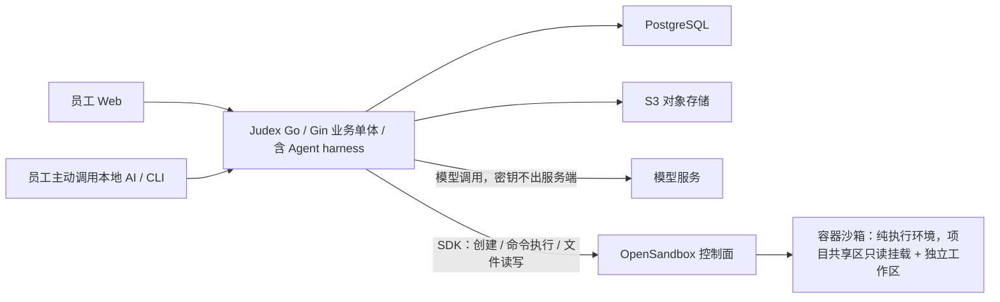

# Judex 详细设计

版本：设计基线 0.2。整理日期：2026-09-25。本日修订：经 OpenSandbox 实际架构核验，Agent harness 与模型调用改在服务端，沙箱为纯执行环境；共享资料只读挂载进沙箱工作区，发布经平台工具并声明来源版本。见 06、11 与决策记录。

本文档集整理已确认业务规则、Q056～Q064 技术选型和 Q065～Q075 Agent / 工作目录决定。正式前后端工程骨架和 Helm 模板已生成，业务后端与 Agent 执行仍待实现；准确状态见 [13 工程骨架与实现状态](./13-工程骨架与实现状态.md)。

## 1. 阅读与效力

文档统一区分三类内容：

- **已确认**：来自用户明确答复，开发不得自行改变。
- **设计方案**：为实现已确认目标提出的模块、表结构、接口和部署方式，可以在评审中细化；不把它们记成用户已逐项批准。
- **待定**：缺少产品或运行条件，不以未写明的假设替代决定；登记在 [待定事项](./10-决策记录与待定事项.md)。

最新用户答复优先于旧讨论。历史 V1 的分支命名、版本发布顺序、状态机及基础设施选择不自动继承。灵感工作室 2.0 保留交互验证价值，Demo 的配色、字体、布局细节和 localStorage 数据格式不构成正式设计限制。

## 2. 已确认基线

| 范围 | 当前决定 | 依据 |
| --- | --- | --- |
| 使用形态 | 公司内部私有部署，首期就是注册制 | Q060、最新 Q063 |
| 账号 | 公司人员自由注册、自由创建项目；所有账号在平台业务层平级 | 最新 Q063 |
| 权限 | 成员在不同项目中分别承担管理、岗位和工作职责 | 最新 Q063，V2-Q007、Q037～Q045 |
| 项目加入 | 管理者邀请并指定职位；注册不自动加入已有项目 | 既有明确答复；最新注册制未取消项目邀请规则 |
| 前端 | React、Zustand、Tailwind CSS；服务端状态交给 TanStack Query | 技术讨论、Q064 |
| UI | HeroUI 为唯一基础组件库；正式视觉不必照搬 Demo | Q061、Q056 补充 |
| 后端 | Go，HTTP 框架 Gin，前期模块化业务单体 | Q057及首期单体要求 |
| Agent | 参考 pi 的 read/bash/edit/write、上下文组装和压缩，自行实现业务 Agent 工具 | Q058 |
| Agent 执行架构 | harness 与模型调用在服务端；沙箱为纯执行环境（经 OpenSandbox SDK 派发命令与文件操作），零平台凭据、egress 默认关闭；项目共享区只读挂载到 `/workspace/project`，发布走 publish 工具并声明来源版本，来源落后报错重做 | 2026-09-25 修订，依据 OpenSandbox 实际架构核验 |
| 多 Agent 协作 | 首期中心协调，已有分工优先；允许独立并行和逐个返回，不开放岗位自由互聊 | Q065、Q067、Q068 |
| 模型配置 | 部署统一提供模型与凭据，项目与职位在允许范围内选择 | Q066 |
| A2A | 首期暂无外部 Agent 接入需求，内部不强制采用，保留适配边界 | Q069 |
| 执行隔离 | OpenSandbox 容器沙箱，与 Judex 在同一 K8s 集群部署 | 技术讨论与 Q072 后补充 |
| 存储 | PostgreSQL 保存平台事实与执行期运行上下文（2026-09-25 修订：取消独立 SQLite）；文件进对象存储 | Q059、Q060、Q070 及同日修订 |
| 共享资料 | 以项目为共享单位，计划文件按计划 / 文件名组织；项目内取消逐文件授权，项目之间隔离 | Q073、Q074 |
| 私有与派生 | 私人提示词、密钥和私有执行上下文不进共享区；原件只读，工作区派生，明确提交后登记新共享草稿 | Q074、Q075 |
| HTML 分析 | 按需使用沙箱浏览器，文字与附件及依赖共同追溯 | Q072 |
| 对象存储 | 内置方案 SeaweedFS；业务侧使用 S3 接口 | Q062 |
| 部署 | Kubernetes + Helm，整套安装；开发 / 生产配置区分，生产可分别选择内置或外部 PostgreSQL、对象存储 | Q060 |
| 生产可用性 | **尚未确认**；最新 Q063 回答了注册和角色形态，没有确认允许停机或高可用目标 | 最新 Q063 |

## 3. 文档目录

| 文档 | 内容 |
| --- | --- |
| [01 产品边界与身份权限](./01-产品边界与身份权限.md) | 注册、项目角色、岗位身份、邀请、替换和授权矩阵 |
| [02 业务对象与协作流程](./02-业务对象与协作流程.md) | 计划任务、提案、审批、交接、验收和异常闭环 |
| [03 前端架构与交互组件](./03-前端架构与交互组件.md) | HeroUI、状态分工、目录、页面与组件、卡片树 |
| [04 后端架构与模块边界](./04-后端架构与模块边界.md) | Go + Gin 单体、模块依赖、事务与后台任务 |
| [05 数据模型与文件存储](./05-数据模型与文件存储.md) | PostgreSQL 逻辑表、对象存储、版本与数据一致性 |
| [06 Agent 执行与上下文](./06-Agent执行与上下文.md) | Go harness、pi 参考范围、OpenSandbox、工具、压缩与恢复 |
| [07 API 事件与本地接入](./07-API事件与本地接入.md) | 接口契约草案、SSE、幂等、CLI / Skill 和人工决定 |
| [08 Helm 与 Kubernetes 部署](./08-Helm与Kubernetes部署.md) | 全量安装、环境隔离、四种存储组合、迁移与恢复 |
| [09 测试验收与实施顺序](./09-测试验收与实施顺序.md) | 验收矩阵、临时 Namespace、实施阶段与发布门槛 |
| [10 决策记录与待定事项](./10-决策记录与待定事项.md) | Q056～Q075 追踪、工程候选、待定项与官方参考 |
| [11 工作目录与动态上下文](./11-工作目录与动态上下文.md) | 三层存储、项目共享只读挂载、派生发布、提示词组装与恢复 |

## 4. 总体边界

实际开发、设计、测试、部署等工作由人员及其本地工具完成。平台 AI 在沙箱中分析获准材料、协调线上机器人、提出草稿和建议；不主动启动成员电脑，不代为执行未获授权的现实业务操作。

平台注册身份、项目成员角色、稳定任职身份、Agent 运行实例、实际审批操作者分别建模。机器人持续承载业务历史；更换人员不改写历史决定。

## 5. 当前实现与下一步

交互预览已迁入正式 HeroUI 工程，并接入 Go HTTP 壳层及 Helm 模板。工作安排、交接、退回补交、任务 / 计划验收、岗位替换与卡片树仍为预览数据；完整会签、真实 Agent、注册认证、数据持久化尚待实现。

数据库逻辑模型、API 草案、单体内模块和安装流程是本轮设计产物；实施时必须补齐迁移、权限验证、失败恢复和端到端证据，不能用文档完成代替运行验收。
